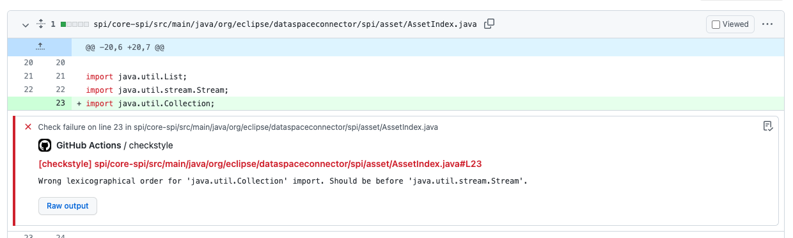
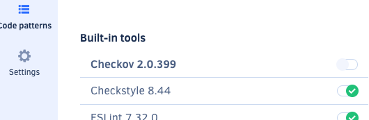

# ADR on Code Quality

# Overview of tools

| Tool       | Analysis Type | Description                                                                                                                                                                                                            |
|------------|---------------|------------------------------------------------------------------------------------------------------------------------------------------------------------------------------------------------------------------------|
| Checkstyle | Source code   | Focuses on coding style making sure a team adheres to some standards including naming, braces, indentation, javadoc on public methods, etc.                                                                            |
| PMD        | Source code   | Focuses on common programming flaws like unused variables, empty catch blocks, unnecessary object creation. PMD also tells you about the [Cyclomatic complexity](https://en.wikipedia.org/wiki/Cyclomatic_complexity). |
| Spotbugs   | Byte code     | Focuses on common programming flaws that can not be found with source code analysis like infinite loop, equals method always returns true, opened streams, a collection which contains itself, etc.                    |

## Checkstyle 

[Checkstyle](https://checkstyle.org/) is a static code analysis tool to help programmers write Java code that adheres to a coding standard (coding style, naming patterns, indentation, etc..)

### Running Checkstyle

Use the [Checkstyle Gradle Plugin](https://docs.gradle.org/current/userguide/checkstyle_plugin.html) to run Checkstyle.

```kotlin
plugins {
    checkstyle
}

```

Checkstyle can be configured using [properties](https://docs.gradle.org/current/dsl/org.gradle.api.plugins.quality.CheckstyleExtension.html):

```kotlin
checkstyle {
        configFile = rootProject.file("resources/edc-checkstyle-config.xml")
        maxErrors = 0 
    }
```

Checkstyle generates reports which can be configured: 

```kotlin
tasks.withType<Checkstyle> {
        reports {
            html.required.set(false)
            xml.required.set(false)
        }
    }
```

### Usage of Checkstyle in EDC

Checkstyle is configured in EDC repository running on every build. It's configured to break the build on every error or warning.

Checkstyle is set up to run explicitly in [Github Workflow](./.github/workflows/verify.yaml) on every change in a Pull Request posting comments on every 
failure:




More information about Checktyle in EDC can be found in [the doc about the style guide](./styleguide.md).

### Running Checkstyle with Codacy

Checkstyle is available as a built-in tool in Codacy. By clicking on the tool the Checkstyle rule set can be configured. 




With this feature toggled Codacy scans the code and can apply the checks on the PRs. From the Codacy dashboard we can see the issues found by Checkstyle 
with an explanation why it's an issue:


Codacy offers also an integration with Github Actions checks that can be applied on new PRs.

It can be enabled from Codacy website -> Settings -> Integrations


With that we can see the checks reports under the PRs in Github:


Going into details we can see a link to the issues report on Codacy:


## PMD

PMD is a Java source code analyzer that finds common programming flaws like unused variables, empty catch blocks, unnecessary object creation, and so forth. It provides predefined rule sets that can be used out of the box grouped in different categories: bestpractices, documentation, multithreading, performance, etc. Often these defaults are a bit too extensive and lead to a big amount of issues detected, so it is advisable to create a custom rule set for the most meaningful patterns. The [pmd-rules.xml](./resources/pmd-rules.xml) file defines a custom rule set that was used in a [previous project](https://github.com/catenax/tractusx/blob/main/coreservices/partsrelationshipservice/ci/pmd-rules.xml)

### Running PMD with the IntelliJ plugin

The [Intellij PMD plugin](https://plugins.jetbrains.com/plugin/1137-pmdplugin) runs PMD directly from the IDE with either a predefined set of rules or custom ones from the project.

Unfortunately the plugin does not allow to configure the minimum priority threshold for issues, leading to a full-blown violations report.

### Running PMD with Gradle

Use the [PMD Gradle Plugin](https://docs.gradle.org/current/userguide/pmd_plugin.html) to run PMD.

```kotlin
plugins {
    pmd
}

pmd {
    isConsoleOutput = true
    toolVersion = "6.21.0"
    rulesMinimumPriority.set(1)
    ruleSets = listOf("resources/pmd-rules.xml")
}
```

The `rulesMinimumPriority` allows to set the minimum priority level of violations for failing the build.

### Reported EDC issues

Running PMD on EDC results in over 27000 violations at the time of writing with the predefined rulesets. Using the [pmd-rules.xml](./resources/pmd-rules.xml) ruleset we end up with 15000 violations.

A quick scan through the findings reveals that most of them are low priority issues like "short class name", "comment size", "too many imports", "method argument could be final". Some others are false positives that don't apply for the code in question like "use concurrent hashmap" in a single-threaded context or "empty catch block" in a code area where this is expected. Among them some interesting items can be found like "mutable static state" or "avoid nested if statements" for a code piece with 3 nested ifs.

Taking a much more targeted [pmd-rules-reduced.xml](./resources/pmd-rules-reduced.xml) ruleset focusing on just few of the most important violations reduces noise and brings the total amount of violations to a much more manageable ~350 items. We encourage starting with a focused small ruleset and add rules bit by bit whenever needed. Rules leading to too many false positives need to be reevaluated if they really bring value and deleted if deemed necessary.  

### Running PMD with Codacy

PMD is also available as a built-in tool in Codacy. It can be configured in the same way as [Checkstyle](#running-checkstyle-with-codacy).

## Spotbugs

[Spotbugs](https://spotbugs.github.io/) is a program which uses static analysis to look for bugs in Java code. It looks for instances of “bug patterns” — code instances that are likely to be errors by inspecting Java bytecode.

### Running SpotBugs with the IntelliJ plugin

The [Spotbugs Intellij plugin](https://plugins.jetbrains.com/plugin/14014-spotbugs) runs Spotbugs directly from the IDE. This is the most effective way to look and fix Spotbugs issues from the developers perspective.


### Running SpotBugs with Gradle

Use the [Spotbugs Gradle Plugin](https://github.com/spotbugs/spotbugs-gradle-plugin) to run Spotbugs. 

The plugin is configured to generate html reports and with a file for accepted exclusions. An initial set of exclusions can be taken from sample open source projects like the [Azure Java SDK](https://github.com/Azure/azure-sdk-for-java/blob/main/eng/code-quality-reports/src/main/resources/spotbugs/spotbugs-exclude.xml)

```kotlin
plugins {
    id("com.github.spotbugs") version "5.0.5"
}

dependencies {
    spotbugsPlugins("com.h3xstream.findsecbugs:findsecbugs-plugin:1.11.0")
}

spotbugs {
    ignoreFailures.set(true) // if false, build fails on bugs
    excludeFilter.set(file("$rootDir/resources/spotbugs-excludes.xml"))
}

tasks.spotbugsMain {
    reports.create("html") {
        required.set(true)
        outputLocation.set(file("$buildDir/reports/spotbugs.html"))
        setStylesheet("fancy-hist.xsl")
    }
}
```

The [Find Security Bugs](https://find-sec-bugs.github.io/) plugin extends Spotbugs with additional security checks.

Spotbugs can be quite resource intense. The [effort configuration](https://spotbugs.readthedocs.io/en/stable/effort.html) helps tune Spotbugs accordingly for each individual project.

An own report is generated per each Gradle module. This is not practical as one has to navigate to the different modules to get to the findings, a central aggregated overview would come handy for visualization.


#### Aggregating reports

There is [a plugin](https://github.com/SimonScholz/report-aggregator) available to perform the aggregation. The plugin seems not to be in active development and gives an error when trying to run it:

```
 In plugin 'com.simonscholz.reports' type 'com.simonscholz.report.GenerateAggregatedReportTask' property 'level' is missing an input or output annotation.
```

For the moment it looks like a more custom solution with a XSL aggregation/transformation of Spotbugs XML output files is the most promising approach for achieving aggregated reports with Gradle.

A pragmatic setup would to use the Gradle setup only to enforce that no open Spotbugs issues remain when running CI, while using IDE plugins (like the one mentioned in the previous section) to visualize and fix issues locally.

### Running Spotbugs with Codacy

According to [the docs](https://docs.codacy.com/related-tools/local-analysis/running-spotbugs/), codacy supports Spotbugs integration. 

We configured a [pipeline](.github/workflows/codacy-analysis.yaml) to run Spotbugs on pushes, but we were not able to get the analysis running, as it seems that classes and sources are not detected properly despite trying to define class/source directories as described in the [documentation](https://docs.codacy.com/related-tools/local-analysis/running-spotbugs/#detecting-sources-and-compiled-classes). See [failing CI run](https://github.com/Agera-CatenaX/EclipseDataSpaceConnector/runs/4925578885?check_suite_focus=true).

```
Error executing the tool
java.io.IOException: IOException while scanning codebases
	at edu.umd.cs.findbugs.FindBugs2.execute(FindBugs2.java:311)
	at com.codacy.tools.spotbugs.SpotBugs$.$anonfun$runTool$1(SpotBugs.scala:113)
	at scala.util.Try$.apply(Try.scala:213)
	at com.codacy.tools.spotbugs.SpotBugs$.runTool(SpotBugs.scala:82)
	at com.codacy.tools.spotbugs.SpotBugs$.$anonfun$apply$9(SpotBugs.scala:52)
	at scala.collection.TraversableLike.$anonfun$map$1(TraversableLike.scala:285)
	at scala.collection.immutable.Set$Set2.foreach(Set.scala:181)
	at scala.collection.TraversableLike.map(TraversableLike.scala:285)
	at scala.collection.TraversableLike.map$(TraversableLike.scala:278)
	at scala.collection.AbstractSet.scala$collection$SetLike$$super$map(Set.scala:53)
	at scala.collection.SetLike.map(SetLike.scala:105)
	at scala.collection.SetLike.map$(SetLike.scala:105)
	at scala.collection.AbstractSet.map(Set.scala:53)
	at com.codacy.tools.spotbugs.SpotBugs$.apply(SpotBugs.scala:53)
	at com.codacy.tools.scala.seed.DockerEngine.executeTool(DockerEngine.scala:53)
	at com.codacy.tools.scala.seed.DockerEngine.$anonfun$main$2(DockerEngine.scala:35)
	at scala.util.Success.$anonfun$map$1(Try.scala:255)
	at scala.util.Success.map(Try.scala:213)
	at com.codacy.tools.scala.seed.DockerEngine.$anonfun$main$1(DockerEngine.scala:27)
	at scala.util.Success.flatMap(Try.scala:251)
	at com.codacy.tools.scala.seed.DockerEngine.main(DockerEngine.scala:26)
	at com.codacy.tools.spotbugs.Engine.main(Engine.scala)
Caused by: edu.umd.cs.findbugs.classfile.ResourceNotFoundException: Resource not found: java/lang/Object.class
	at edu.umd.cs.findbugs.classfile.impl.ClassPathImpl.lookupResource(ClassPathImpl.java:162)
	at edu.umd.cs.findbugs.classfile.impl.ClassPathBuilder.build(ClassPathBuilder.java:282)
	at edu.umd.cs.findbugs.FindBugs2.buildClassPath(FindBugs2.java:708)
	at edu.umd.cs.findbugs.FindBugs2.execute(FindBugs2.java:245)
	... 21 more
```

### Reported EDC bugs

A full Spotbugs scan with the IntelliJ plugin configured to run with maximal effort and confidence reports 120 issues in EDC code.

We did a quick evaluation of these issues and estimated the effort it would take to either fix relevant issues or ignore irrelevant ones to get a feeling of the value of using this tool.  

| Bug                                                                              | Description                                                                                                                                                                                                                                                                                                                                    | Fix effort |
|----------------------------------------------------------------------------------|------------------------------------------------------------------------------------------------------------------------------------------------------------------------------------------------------------------------------------------------------------------------------------------------------------------------------------------------|------------|
| SA_FIELD_SELF_ASSIGNMENT                                                         | Self-assignment to field. Such assignments are useless, and may indicate a logic error or typo.                                                                                                                                                                                                                                                | low        |
| NP_NONNULL_RETURN_VIOLATION, NP_NONNULL_PARAM_VIOLATION, NP_NULL_PARAMETER_DEREF | Detection of possible null return values or parameters for elements annotated with @NotNull                                                                                                                                                                                                                                                    | low        |
| DM_RANDOM_USED_ONLY_ONCE                                                         | This code creates a java.util.Random object, uses it to generate one random number, and then discards the Random object. This produces mediocre quality random numbers and is inefficient.                                                                                                                                                     | low        |
| DM_DEFAULT_ENCODING                                                              | Reliance on default encoding. Found a call to a method which will perform a byte to String (or String to byte) conversion, and will assume that the default platform encoding is suitable. This will cause the application behaviour to vary between platforms. Use an alternative API and specify a charset name or Charset object explicitly | low        |
| MS_SHOULD_BE_FINAL                                                               | This static field public but not final, and could be changed by malicious code or by accident from another package. The field could be made final to avoid this vulnerability.                                                                                                                                                                 | low        |
| RDN_REDUNDANT_NULL_CHECK_OF_NON_NULL_VALUE                                       | This error does not seem to hold high priority as reported as its just a redundant @NotNull indication.                                                                                                                                                                                                                                        | low        |

Some issues found might lead to real problems when using EDC in production. Given that false positives can be easily ignored using annotations or exclusion filters we highly encourage using Spotbugs as we see a high value VS effort ratio. A suggestion could be to start with a rather lenient configuration and increase strictness as appropriate.  
