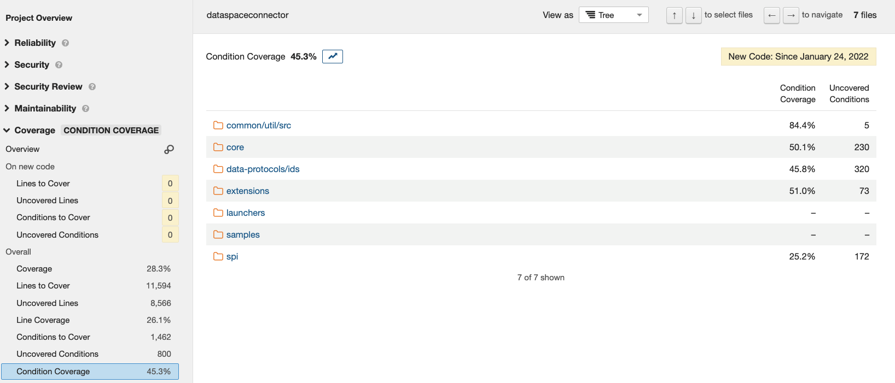

# ADR on Test Coverage

Test code coverage is a measure of the source code that executed when a test suite is run. A program with high test coverage has a lower chance of containing bugs.

## Spikes

### Option 1: JaCoCo

JaCoCo (Java Code Coverage) is a popular and mature open-source tool. It runs as a Java agent during test execution, to capture which lines are exercised during which test.

Capturing coverage for a particular project in JaCoCo is straightforward, using the [Gradle JaCoCo Plugin](https://docs.gradle.org/current/userguide/jacoco_plugin.html).

```kotlin
// build.gradle.kts
plugins {
    jacoco
}
```

This yields an HTML report.


The report can be drilled to highlight covered lines (green), not covered lines (red), and lines where some execution branches are not covered (orange).


This configuration has limited value since each project produces its own report. Furthermore, there is no indication of whether a given commit is increasing or decreasing coverage, and in which areas of the code.

### Option 2: JaCoCo with aggregation

The Gradle documentation includes a sample for [Reporting code coverage across multiple sub-projects with JaCoCo](https://docs.gradle.org/current/samples/sample_jvm_multi_project_with_code_coverage.html). The sample explains how to generate a single aggregated report.

We were not able to get the sample working in the EDC repository.

In any case, extensive complex Kotlin code needs to be added to the build. This is concerning for maintainability.

As it would anyway not solve the problem that code coverage is best analyzed relatively to a previous commit, we did not attempt further to get the sample working.

### Option 3: JaCoCo with Codecov

Codecov is an online service for code coverage analysis that promises to "always be free for open source projects". We have been widely using it in various (open-source and proprietary) projects for years with good results.

We modified the root `build.gradle.kts` file to apply the JaCoCo plugin to all projects, and produce an XML format report that can be used by Codecov:

```kotlin
// build.gradle.kts

allprojects {
     //...
     apply(plugin = "jacoco")
     
     //...
     tasks.jacocoTestReport {
         reports {
             xml.required.set(true)
         }
     }
}

```

We modified the `.github/workflows/verify.yaml` workflow as follows:

```
      - name: Gradle Test Core
         run: ./gradlew clean check jacocoTestReport

       - name: CodeCov
         uses: codecov/codecov-action@v2
         with:
           token: ${{ secrets.CODECOV_TOKEN }}
```

The token is supposedly not required for open-source projects, but we got an error running the action without providing a token.

By logging in at https://about.codecov.io with our GitHub Account, we were able to browse straight away to our EDC (fork) repository and obtain a token for the repository. We added the token as a GitHub secret.

We merged a PR with the action configuration above into the `main` (default) branch of our fork repository, for Codecov to report code coverage differences in PRs.

Finally, we installed the Codecov GitHub app into the repository, to enable the Codecov bot to post comments directly into PRs.

The Codecov online site provides detailed coverage reports. These reports also measure cyclomatic complexity.


In PRs, the Codecov bot automatically posts a report indicating coverage changes.


These reports can also be accessed from the Codecov online service.


The report can be drilled to highlight the code subjected to coverage changes.


The configuration of Codecov can be adjusted in a [`codecov.yaml` configuration file](https://docs.codecov.com/docs/codecov-yaml). That allows for example configuration to ensure each new PR [does not decrease coverage](https://docs.codecov.com/docs/common-recipe-list#increase-overall-coverage-on-each-pull-request).

### Option 4: JaCoCo with Codacy

[Codacy](https://www.codacy.com/) is an online service for both static code analysis and test code coverage analysis. It is free for Open Source projects.

We [enrolled our repository fork](https://docs.codacy.com/getting-started/codacy-quickstart/) into Codacy using its Web UI, and obtained a [Project API token](https://docs.codacy.com/codacy-api/api-tokens/) which we set up as a GitHub secret.

We used the modified `build.gradle.kts` file as above to create JaCoCo XML reports. We then used the [Codacy GitHub action](https://github.com/codacy/codacy-coverage-reporter-action) to upload our reports. The `find ` command is set up to exclude one XML report with empty content that is 240 bytes long, and causes the following action to fail.

```yaml
       - name: Set Coverage Report Paths
         id: coverage-paths
         run: |
           echo -n "::set-output name=COVERAGE_REPORT_PATHS::"
           find . -name jacocoTestReport.xml -size +300c -printf '%p,'
           
       - name: Publish Code Coverage Results
         uses: codacy/codacy-coverage-reporter-action@v1
         with:
           project-token: ${{ secrets.CODACY_PROJECT_TOKEN }}
           coverage-reports: ${{ steps.coverage-paths.outputs.COVERAGE_REPORT_PATHS }}
```

The action worked, but the coverage reports are still not being displayed in the [Codacy UI](https://app.codacy.com/gh/Agera-CatenaX/EclipseDataSpaceConnector/settings/coverage). We are talking to Codacy support to investigate the issue.

### Option 5: JaCoCo with SonarQube

[SonarQube](https://docs.sonarqube.org/latest/setup/get-started-2-minutes/) is a platform for both static code analysis and test code coverage analysis. It offers an open source Community 
Edition version, which is free but has some limitations. 

SonarQube can be run locally by adding a SonarQube plugin to gradle and e.g. running SonarQube instance from docker.

Add Gradle plugin:

```gradle
plugin {
    id("org.sonarqube") version "3.3"
}
```

To enable code coverage reports test coverage reports should be generated (explained in sections: Option 1 and Option 2).

Docker-compose file with minimal configuration:

```yml
version: "3"
services:
  sonarqube:
    image: sonarqube:lts
    ports:
      - 9000:9000
    environment:
      - SONAR_FORCEAUTHENTICATION=false
```

Then when sonar is up current project can be added to the analysis by running a command:

```bash
./gradlew sonarqube
```

Above mentioned configuration works when SonarQube is running on default url: http://localhost:9000 and jacoco reports are placed in default location.
Otherwise these properties should be set: _sonar.host.url_, _sonar.jacoco.reportPaths_. Here can be found more information about [sonarqube Gradle plugin](https://docs.sonarqube.org/latest/analysis/scan/sonarscanner-for-gradle/).

Code coverage analysis with SonarQube:



### Integration with Github Actions

Integration with github Actions wasn't a part of this spike, because it requires having a SonarQube instance deployed for the whole project, instead of using 
localhost version.

More information about [Github Integration](https://docs.sonarqube.org/latest/analysis/github-integration/).

[Github Action that helps to run the code analysis.](https://github.com/marketplace/actions/official-sonarqube-scan)

### Limitations of the Community Edition version

- Analysis of multiple branches is not supported
- Reporting measures to branches and pull requests in Github not supported
- Automatic detection of branches/pull requests in Github Actions not supported