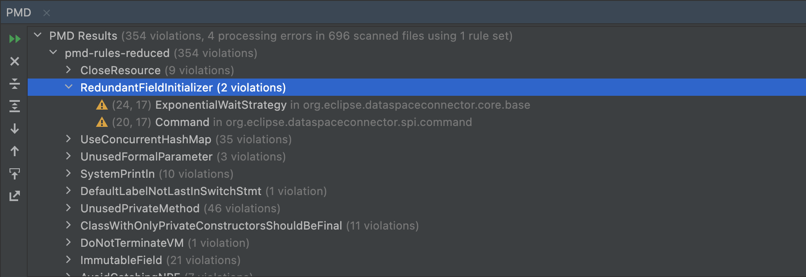

# PMD

PMD is a Java source code analyzer that finds common programming flaws like unused variables, empty catch blocks, unnecessary object creation, and so forth. It provides predefined rule sets that can be used out of the box grouped in different categories: bestpractices, documentation, multithreading, performance, etc. Often these defaults are a bit too extensive and lead to a big amount of issues detected, so it is advisable to create a custom rule set for the most meaningful patterns. The [pmd-rules.xml](./resources/pmd-rules.xml) file defines a custom rule set that was used in a [previous project](https://github.com/catenax/tractusx/blob/main/coreservices/partsrelationshipservice/ci/pmd-rules.xml)

## Running PMD with the IntelliJ plugin

The [Intellij PMD plugin](https://plugins.jetbrains.com/plugin/1137-pmdplugin) runs PMD directly from the IDE with either a predefined set of rules or custom ones from the project. On a machine with a 2.3Ghz 8-Core Intel Core i9 CPU running the Intellij plugin around 3 minutes.

Unfortunately the plugin does not allow to configure the minimum priority threshold for issues, leading to a full-blown violations report.



## Running PMD with Gradle

Use the [PMD Gradle Plugin](https://docs.gradle.org/current/userguide/pmd_plugin.html) to run PMD. On a machine with a 2.3Ghz 8-Core Intel Core i9 CPU running `gradle pmdMain` takes 1.5 minutes.

The plugin reports a series of warnings for rules that will be deprecated in the next PMD 7.0.0 version. See [PMD documentation](https://pmd.github.io/latest/pmd_next_major_development.html#list-of-currently-deprecated-rules) for more information.

```kotlin
plugins {
    pmd
}

pmd {
    isConsoleOutput = true
    toolVersion = "6.41.0"
    ruleSets = listOf("resources/pmd-rules-reduced.xml")
}

tasks.pmdTest {  // do not run PMD on test code
    enabled = false
}
```

The `rulesMinimumPriority` field allows to set the minimum priority level of violations for failing the build.

An own report is generated per each Gradle module. This is not practical as one has to navigate to the different modules to get to the findings, a central aggregated overview would come handy for visualization. There is a [Maven plugin](https://maven.apache.org/plugins/maven-pmd-plugin//aggregate-pmd-mojo.html) to aggregate PMD reports but unfortunately this does not seem to be the case for Gradle. A custom aggregation solution would need to be built in this case.

A pragmatic setup could be to use the Gradle setup only to enforce that no open PMD issues remain when running CI, while using IDE plugins to visualize and fix issues locally.

## Running PMD with Codacy

PMD is also available as a built-in tool in Codacy. It can be configured in the same way as [Checkstyle](#running-checkstyle-with-codacy).

## Reported EDC violations

Running PMD on EDC results in over 27000 violations at the time of writing with the predefined rulesets. Using the [pmd-rules.xml](./resources/pmd-rules.xml) ruleset we end up with 15000 violations.

A quick scan through the findings reveals that most of them are low priority issues like "short class name", "comment size", "too many imports", "method argument could be final". Some others are false positives that don't apply for the code in question like "use concurrent hashmap" in a single-threaded context or "empty catch block" in a code area where this is expected. Among them some interesting items can be found like "mutable static state" or "avoid nested if statements" for a code piece with 3 nested ifs.

Taking a much more targeted [pmd-rules-reduced.xml](./resources/pmd-rules-reduced.xml) ruleset focusing on just few of the most important violations reduces noise and brings the total amount of violations to a much more manageable ~350 violations spread accross 50 different rules. We encourage starting with a focused small ruleset and add rules bit by bit whenever needed. Rules leading to too many false positives need to be reevaluated if they really bring value and deleted if deemed necessary.

| Priority | Rule | Rule Set | URL | Occurrences |
|----------| ---- | -------- | ---- | ---------- |
| 🚨 1     | AbstractClassWithoutAnyMethod | Design | https://pmd.github.io/pmd-6.41.0/pmd_rules_java_design.html#abstractclasswithoutanymethod | 1 |
| 🚨 1     | ClassWithOnlyPrivateConstructorsShouldBeFinal | Design | https://pmd.github.io/pmd-6.41.0/pmd_rules_java_design.html#classwithonlyprivateconstructorsshouldbefinal | 11 |
| 🚨 1     | ConstructorCallsOverridableMethod | Error Prone | https://pmd.github.io/pmd-6.41.0/pmd_rules_java_errorprone.html#constructorcallsoverridablemethod | 3 |
| ⚠️ 2     | AvoidReassigningParameters | Best Practices | https://pmd.github.io/pmd-6.41.0/pmd_rules_java_bestpractices.html#avoidreassigningparameters | 10 |
| ⚠️ 2     | SystemPrintln | Best Practices | https://pmd.github.io/pmd-6.41.0/pmd_rules_java_bestpractices.html#systemprintln | 10 |
| ❕ 3      | AbstractClassWithoutAbstractMethod | Best Practices | https://pmd.github.io/pmd-6.41.0/pmd_rules_java_bestpractices.html#abstractclasswithoutabstractmethod | 7 |
| ❕ 3      | AddEmptyString | Performance | https://pmd.github.io/pmd-6.41.0/pmd_rules_java_performance.html#addemptystring | 2 |
| ❕ 3        | ArrayIsStoredDirectly | Best Practices | https://pmd.github.io/pmd-6.41.0/pmd_rules_java_bestpractices.html#arrayisstoreddirectly |
| ❕ 3        | AssignmentInOperand | Error Prone | https://pmd.github.io/pmd-6.41.0/pmd_rules_java_errorprone.html#assignmentinoperand |
| ❕ 3        | AssignmentToNonFinalStatic | Error Prone | https://pmd.github.io/pmd-6.41.0/pmd_rules_java_errorprone.html#assignmenttononfinalstatic |
| ❕ 3        | AvoidCatchingNPE | Error Prone | https://pmd.github.io/pmd-6.41.0/pmd_rules_java_errorprone.html#avoidcatchingnpe |
| ❕ 3        | AvoidCatchingThrowable | Error Prone | https://pmd.github.io/pmd-6.41.0/pmd_rules_java_errorprone.html#avoidcatchingthrowable |
| ❕ 3        | AvoidDeeplyNestedIfStmts | Design | https://pmd.github.io/pmd-6.41.0/pmd_rules_java_design.html#avoiddeeplynestedifstmts |
| ❕ 3        | AvoidDuplicateLiterals | Error Prone | https://pmd.github.io/pmd-6.41.0/pmd_rules_java_errorprone.html#avoidduplicateliterals |
| ❕ 3        | AvoidInstantiatingObjectsInLoops | Performance | https://pmd.github.io/pmd-6.41.0/pmd_rules_java_performance.html#avoidinstantiatingobjectsinloops |
| ❕ 3        | AvoidPrintStackTrace | Best Practices | https://pmd.github.io/pmd-6.41.0/pmd_rules_java_bestpractices.html#avoidprintstacktrace |
| ❕ 3        | AvoidReassigningLoopVariables | Best Practices | https://pmd.github.io/pmd-6.41.0/pmd_rules_java_bestpractices.html#avoidreassigningloopvariables |
| ❕ 3        | AvoidRethrowingException | Design | https://pmd.github.io/pmd-6.41.0/pmd_rules_java_design.html#avoidrethrowingexception |
| ❕ 3        | CloseResource | Error Prone | https://pmd.github.io/pmd-6.41.0/pmd_rules_java_errorprone.html#closeresource |
| ❕ 3        | CompareObjectsWithEquals | Error Prone | https://pmd.github.io/pmd-6.41.0/pmd_rules_java_errorprone.html#compareobjectswithequals |
| ❕ 3        | ConstantsInInterface | Best Practices | https://pmd.github.io/pmd-6.41.0/pmd_rules_java_bestpractices.html#constantsininterface |
| ❕ 3        | CouplingBetweenObjects | Design | https://pmd.github.io/pmd-6.41.0/pmd_rules_java_design.html#couplingbetweenobjects |
| ❕ 3        | CyclomaticComplexity | Design | https://pmd.github.io/pmd-6.41.0/pmd_rules_java_design.html#cyclomaticcomplexity |
| ❕ 3        | DefaultLabelNotLastInSwitchStmt | Best Practices | https://pmd.github.io/pmd-6.41.0/pmd_rules_java_bestpractices.html#defaultlabelnotlastinswitchstmt |
| ❕ 3        | DoNotTerminateVM | Error Prone | https://pmd.github.io/pmd-6.41.0/pmd_rules_java_errorprone.html#donotterminatevm |
| ❕ 3        | DoubleBraceInitialization | Best Practices | https://pmd.github.io/pmd-6.41.0/pmd_rules_java_bestpractices.html#doublebraceinitialization |
| ❕ 3        | EmptyCatchBlock | Error Prone | https://pmd.github.io/pmd-6.41.0/pmd_rules_java_errorprone.html#emptycatchblock |
| ❕ 3        | EmptyIfStmt | Error Prone | https://pmd.github.io/pmd-6.41.0/pmd_rules_java_errorprone.html#emptyifstmt |
| ❕ 3        | FinalFieldCouldBeStatic | Design | https://pmd.github.io/pmd-6.41.0/pmd_rules_java_design.html#finalfieldcouldbestatic |
| ❕ 3        | ForLoopVariableCount | Best Practices | https://pmd.github.io/pmd-6.41.0/pmd_rules_java_bestpractices.html#forloopvariablecount |
| ❕ 3        | GodClass | Design | https://pmd.github.io/pmd-6.41.0/pmd_rules_java_design.html#godclass |
| ❕ 3        | IdempotentOperations | Error Prone | https://pmd.github.io/pmd-6.41.0/pmd_rules_java_errorprone.html#idempotentoperations |
| ❕ 3        | ImmutableField | Design | https://pmd.github.io/pmd-6.41.0/pmd_rules_java_design.html#immutablefield |
| ❕ 3        | LiteralsFirstInComparisons | Best Practices | https://pmd.github.io/pmd-6.41.0/pmd_rules_java_bestpractices.html#literalsfirstincomparisons |
| ❕ 3        | LooseCoupling | Best Practices | https://pmd.github.io/pmd-6.41.0/pmd_rules_java_bestpractices.html#loosecoupling |
| ❕ 3        | MethodReturnsInternalArray | Best Practices | https://pmd.github.io/pmd-6.41.0/pmd_rules_java_bestpractices.html#methodreturnsinternalarray |
| ❕ 3        | MissingOverride | Best Practices | https://pmd.github.io/pmd-6.41.0/pmd_rules_java_bestpractices.html#missingoverride |
| ❕ 3        | NullAssignment | Error Prone | https://pmd.github.io/pmd-6.41.0/pmd_rules_java_errorprone.html#nullassignment |
| ❕ 3        | RedundantFieldInitializer | Performance | https://pmd.github.io/pmd-6.41.0/pmd_rules_java_performance.html#redundantfieldinitializer |
| ❕ 3        | SimpleDateFormatNeedsLocale | Error Prone | https://pmd.github.io/pmd-6.41.0/pmd_rules_java_errorprone.html#simpledateformatneedslocale |
| ❕ 3        | SimplifyBooleanReturns | Design | https://pmd.github.io/pmd-6.41.0/pmd_rules_java_design.html#simplifybooleanreturns |
| ❕ 3        | SimplifyStartsWith | Performance | https://pmd.github.io/pmd-6.41.0/pmd_rules_java_performance.html#simplifystartswith |
| ❕ 3        | SingularField | Design | https://pmd.github.io/pmd-6.41.0/pmd_rules_java_design.html#singularfield |
| ❕ 3        | UnusedFormalParameter | Best Practices | https://pmd.github.io/pmd-6.41.0/pmd_rules_java_bestpractices.html#unusedformalparameter |
| ❕ 3        | UnusedLocalVariable | Best Practices | https://pmd.github.io/pmd-6.41.0/pmd_rules_java_bestpractices.html#unusedlocalvariable |
| ❕ 3        | UnusedPrivateField | Best Practices | https://pmd.github.io/pmd-6.41.0/pmd_rules_java_bestpractices.html#unusedprivatefield |
| ❕ 3        | UnusedPrivateMethod | Best Practices | https://pmd.github.io/pmd-6.41.0/pmd_rules_java_bestpractices.html#unusedprivatemethod |
| ❕ 3        | UseCollectionIsEmpty | Best Practices | https://pmd.github.io/pmd-6.41.0/pmd_rules_java_bestpractices.html#usecollectionisempty |
| ❕ 3        | UseConcurrentHashMap | Multithreading | https://pmd.github.io/pmd-6.41.0/pmd_rules_java_multithreading.html#useconcurrenthashmap |
| ❕ 3        | UseIndexOfChar | Performance | https://pmd.github.io/pmd-6.41.0/pmd_rules_java_performance.html#useindexofchar |

A quick look through the top priority issues reveals that although a quick fix for the issues is easy to implement, often bugs uncover suboptimal software design constructs. Fixing the software design issues might lead to implementation tasks not to be underestimated.