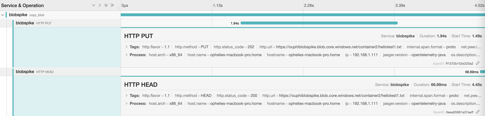

# Azure Blob Storage Copy

We evaluated the possibility to copy a blob.

## Copy with Java SDK

We evaluated the [Java azure storage client library](https://docs.microsoft.com/en-us/java/api/overview/azure/storage-blob-readme?view=azure-java-stable) to copy blobs.

### Evaluate if copy can be done from source to destination, with the client not handling any data flow

The Java blob is on top of the [Blob service REST API](https://docs.microsoft.com/en-us/rest/api/storageservices/blob-service-rest-api).
The client calls [an endpoint](https://docs.microsoft.com/en-us/rest/api/storageservices/copy-blob-from-url) to trigger the copy of a blob.
The client receives an answer, the copy is then done asynchronously.
In order to know if the copy is finished, the client needs to [get the blob properties](https://docs.microsoft.com/en-us/rest/api/storageservices/get-blob-properties) by calling the REST API in order to know if the copy operation is finished.

### Copy duration

Copy of a 1GB file from West Europe to East US takes around 9 minutes.
Copy of a 256MB file from West Europe to East US takes 30 to 40 seconds.
Copy of a 1MB file from West Europe to East US 1 to 1.5 seconds.

## Evaluation of copy vs streaming

We have 2 solutions to transfer data from a blob to another blob.

- Use the [BlobClient](https://docs.microsoft.com/en-us/java/api/com.azure.storage.blob.blobclient?view=azure-java-stable) to trigger a copy of source blob to destination blob.
- Use the [BlockBlobClient](https://docs.microsoft.com/en-us/java/api/com.azure.storage.blob.specialized.blockblobclient?view=azure-java-stable) to get a stream from blob to VM and transfer from VM to blob with another stream.

Pros: During the copy, Network I/O is only between the 2 storage accounts. The client does not need to download any data.
Cons: The storage account you download the data from needs to be accessible from the internet. With the stream, the provider and the storage account could be in the same private network. Then, only the destination storage account would need to be accessible from the internet.

### Azure Blob Copy within same container

To copy Azure Blob within the same container using Azure Java SDK we can use BlobContainerClient.

```java

BlobContainerClient container = new BlobContainerClientBuilder()
                .connectionString(storageAccountConnectionString)
                .containerName(containerName)
                .buildClient();

BlobClient sourceBlobClient = container.getBlobClient(sourceBlobName);
BlobClient destBlobClient = container.getBlobClient(destinationBlobName);

```

Now using the destination and source blob clients we can trigger the copying:

```java

String source = sourceBlobClient.getBlobUrl();
// It will trigger a copy by calling the blob service REST API.
destBlobClient.beginCopy(source, Duration.ofSeconds(1L));
        
```

Method _beginCopy_ triggers an asynchronous operation of copying the data at the source URL to a blob.
To fetch the status of the operation we can use poller and poll for the status manually checking if it's complete.

```java
var syncPoller = destBlobClient.beginCopy(source, Duration.ofSeconds(1L));
PollResponse<BlobCopyInfo> response = syncPoller.poll();

while(!response.getStatus().isComplete()) {
    ...
    response = syncPoller.poll();
}
        
```

Alternatively, we can also block the thread waiting for the completion using _waitForCompletion_ method.

```java

var syncPoller = destBlobClient.beginCopy(source, Duration.ofSeconds(1L));
// Wait for polling to complete.
syncPoller.waitForCompletion(Duration.ofSeconds(5));
        
```

### Azure Blob Copy within different containers/different storage accounts within the same tenant/subscription

To copy Azure Blob between containers within the same storage account as well as different storage accounts we can use BlobClients specifying their properties:

```java

// source blob client
BlobClient sourceBlobClient = new BlobClientBuilder()
    .connectionString(sourceBlob.storageAccountConnectionString)
    .containerName(sourceBlob.containerName)
    .blobName(sourceBlob.blobName)
    .buildClient();

// destination blob client
BlobClient destBlobClient = new BlobClientBuilder()
    .connectionString(destBlob.storageAccountConnectionString)
    .containerName(destBlob.containerName)
    .blobName(destBlob.blobName)
    .buildClient();
```

### Azure Blob Copy between different Azure tenants/subscriptions

#### Copy between tenants using Sas token

Azure Blob can be copied between tenants using Java SDK. It requires creating a sas token to provide appropriate permissions to the blob.

```java

// set permissions for the blob
BlobSasPermission permission = new BlobSasPermission()
    .setReadPermission(true);
// define rule how long the permission is valid
BlobServiceSasSignatureValues sas = new BlobServiceSasSignatureValues(OffsetDateTime.now().plusDays(1), permission)
    .setStartTime(OffsetDateTime.now());
// generate sas token
String sasToken = sourceBlobClient.generateSas(sas);
        
String sourceBlobUrl = sourceBlobClient.getBlobUrl() + "?" + sasToken;

```

### Evaluate Integration testing approach (when actual storage instance is needed Azurite is preferred over cloud infra)

The integration tests can be done with the help of Azurite.
We can run a container and specify the storage accounts name and its key in AZURITE_ACCOUNTS as below:

```bash
docker run -p 10000:10000 -e "AZURITE_ACCOUNTS=account1:key1;account2:key2" mcr.microsoft.com/azure-storage/azurite
```

Then, according credentials can be used in the tests.
For example, you can specify the account-name and the account-key in the connectionString:

`DefaultEndpointsProtocol=http;AccountName=<account-name>;AccountKey=<account-key>;BlobEndpoint=http://127.0.0.1:10000/<account-name>;QueueEndpoint=http://127.0.0.1:10001/<account-name>;`

### Evaluate observability of copy-in-place operations and make sure it is traceable

The blob storage library uses reactor-netty for network I/O. It is [supported by open telemetry](https://github.com/open-telemetry/opentelemetry-java-instrumentation/tree/022914139e0d7156e98efca382397663ed247bde/instrumentation/reactor/reactor-netty).
That's why we can see the HTTP calls corresponding to the blob copy.



The HTTP PUT corresponds to the [blob copy](https://docs.microsoft.com/en-us/rest/api/storageservices/copy-blob-from-url).  
The HTTP HEAD corresponds to the [get blob property](https://docs.microsoft.com/en-us/rest/api/storageservices/get-blob-properties). When the SyncPoller evaluates if the blob copy is finished by checking the blob properties.

## AZ copy 

Using [AzCopy](https://docs.microsoft.com/en-us/azure/storage/common/storage-use-azcopy-blobs-copy) we can copy blob between different storage accounts.
The SAS token needs to be used at the end of source url but destination url doesn't need one if you are logged in into AzCopy using `azcopy login`.

Additionally, [assigning the appropriate](https://docs.microsoft.com/en-us/azure/storage/common/storage-use-azcopy-authorize-azure-active-directory#verify-role-assignments) role to the destination Storage account might be necessary (Storage Blob Data Owner).

```bash
 azcopy cp "https://[srcaccount].blob.core.windows.net/[container]/[path/to/blob]?[SAS]" "https://[destaccount].blob.core.windows.net/[container]/[path/to/blob]"
```

Alternatively we can use SAS tokens for both source and destination urls.

```bash
 azcopy cp "https://[srcaccount].blob.core.windows.net/[container]/[path/to/blob]?[SAS]" "https://[destaccount].blob.core.windows.net/[container]/[path/to/blob]?[SAS]"
```

According to the documentation:
> AzCopy uses server-to-server APIs, so data is copied directly between storage servers. These copy operations don't use the network bandwidth of your computer.

### Copy duration

Copying 1 GB blob between storage accounts in different tenants we got much better results than copying using Java SDK.

Results:

- 1 GB blob between different tenants, storage accounts in the same region (East US) - up to 8 seconds
- 1 GB blob between the tenant in US East and West Europe - up to 12 seconds.

AzCopy offers an option to [increase the number of concurrent requests](https://docs.microsoft.com/en-us/azure/storage/common/storage-use-azcopy-optimize#increase-the-number-of-concurrent-requests) by setting the AZCOPY_CONCURRENCY_VALUE env variable.

By default AZCOPY_CONCURRENCY_VALUE has value 256. According to the documentation:

> If you're copying blobs between storage accounts, consider setting the value of the AZCOPY_CONCURRENCY_VALUE environment variable to a value greater than 1000

When setting the variable to the value above 1000 the results were better.

For copying between the same region ~ 2 seconds, for different regions ~ 6 seconds.

AZCOPY_CONCURRENCY_VALUE can be also set to value `AUTO` which will cause the AzCopy to run automatic tuning process and picks the best value. 
