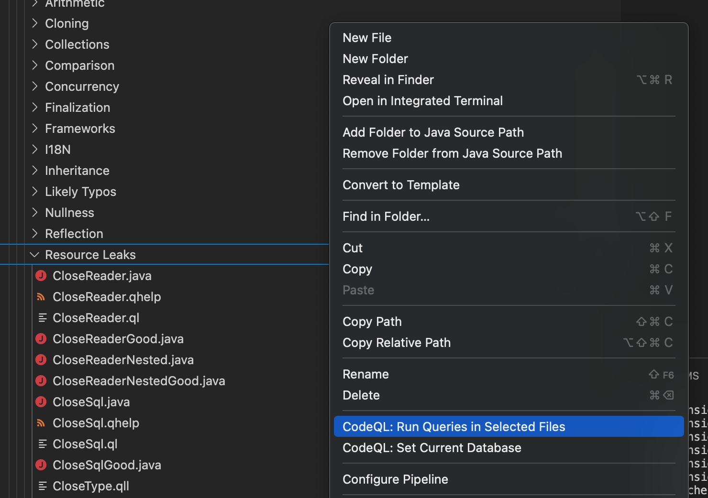
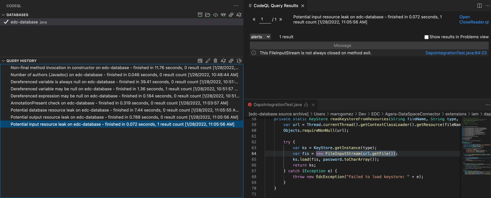
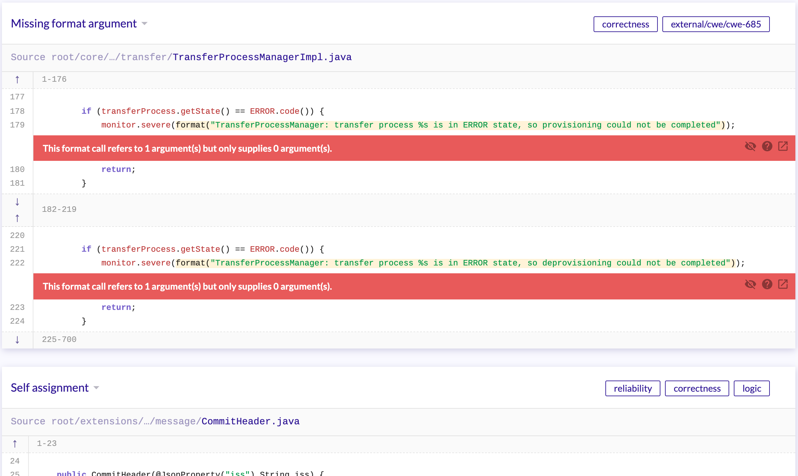

# CodeQL

CodeQL is a semantic code analysis engine developed by GitHub to automate security checks. A database is extracted from source code that can be analysed with a powerful query language. Each single query can be thought of as a “check” or “rule” representing a distinct security vulnerability that is being searched for. There is an available set of standard CodeQL queries, written by GitHub researchers and community contributors, and custom ones can be written too. See [Writing queries](https://codeql.github.com/docs/writing-codeql-queries/codeql-queries/) in the CodeQL docs for more information.

CodeQL is integrated in the EDC CI build in a dedicated [Github workflow](.github/workflows/codeql-analysis.yml). This workflow runs on PRs and commits to the main branch and runs the default set of queries as provided by CodeQL.

## Running CodeQL with Visual Studio Code

CodeQL queries can be run locally using the [Visual Studio Code Extension](https://codeql.github.com/docs/codeql-for-visual-studio-code/setting-up-codeql-in-visual-studio-code/). First we need to build a database using the CodeQL CLI:

```bash
codeql database create --language=java resources/edc-database
```

Once the database is built it can be imported to the available databases in Visual Studio Code as described in [the documentation](https://codeql.github.com/docs/codeql-for-visual-studio-code/analyzing-your-projects/).

Sample queries can be imported from the [CodeQL Github repository](https://github.com/github/codeql). To achieve this clone the repository and import the [java/ql/src](https://github.com/github/codeql/tree/main/java/ql/src) folder into your Visual Studio workspace.

You can run up to 20 simultaneous queries within Visual Studio Code by right-clicking on the desired queries and then selecting "Run Queries in Selected Files"



One of the queries returns a finding which we can inspect by selecting it on the query pane:



Although useful for verifying and debugging single queries, due to the limitation of running at most 20 queries at a time the Visual Studio Code plugin is not an adequate solution to run full query suites.

## Running CodeQL with the CLI

Install the CodeQL CLI as described in the [documentation](https://codeql.github.com/docs/codeql-cli/getting-started-with-the-codeql-cli/#setting-up-the-codeql-cli)

Install the java queries package by running:

```bash
codeql pack download codeql/java-queries
```

If not already done, built a CodeQL database for EDC running:

```bash
codeql database create --language=java resources/edc-database
```

Run the CodeQL analysis using the Java queries:

```bash
codeql database analyze resources/edc-database codeql/java-queries --format=csv --output=analysis-results.csv
```

At the time of writing the latest `codeql/java-queries` pack version is `0.0.7` containing 44 rules giving the following output on the EDC codebase:

```bash
Analysis produced the following diagnostic data:

|             Diagnostic             |                      Summary                       |
+------------------------------------+----------------------------------------------------+
| Diagnostics for framework coverage | 132 results (101 unknowns, 10 errors, 21 warnings) |
| Extraction errors                  | 0 results                                          |
| Successfully extracted files       | 930 results                                        |
| Extraction warnings                | 0 results                                          |
Analysis produced the following metric data:

|               Metric                | Value |
+-------------------------------------+-------+
| Total lines of code in the database | 45911 |
```
No findings are listed in `analyzisis-results.csv` which aligns with the [EDC CodeQL Github workflow](https://github.com/eclipse-dataspaceconnector/DataSpaceConnector/actions) results.

## Running CodeQL with the CodeQL Github Action

The [CodeQL](https://github.com/eclipse-dataspaceconnector/DataSpaceConnector/actions/workflows/codeql-analysis.yml) Gihub workflow in the EDC repository uses the [CodeQL Github Action](https://github.com/github/codeql-action) to run CodeQL. The default java package is used leading to the same results as the ones listed in the previous section.

Running the pipeline takes around ~15mins.

## Running additional CodeQL query suites with the CLI

In addition to the default queries run in the previous sections we tried running an additional suite available in the [CodeQL Github repository](https://github.com/github/codeql). After cloning the repository further java query suites can be found in the `java/ql/src/codeql-suites` directory.

Run the `java-security-and-quality` suite:

```bash
codeql database analyze resources/edc-database <PATH_TO_REPO>/java-security-and-quality.qls --format=csv --output=analysis-results.csv
```

The resulting [analysis-results.csv](analysis-results.csv) contains 200 findings spread across 44 different categories. The following table lists the findings with "error" and "warning" priority:

| Priority   | Name                                     | Description | Count |
|------------|------------------------------------------| ----------- |-------|
| 🚨 error   | Missing format argument                  | A format call with an insufficient number of arguments causes an 'IllegalFormatException'. | 2 |
| 🚨 error   | Self assignment                          | Assigning a variable to itself has no effect. | 1     |
| 🚨 error   | Container contents are never accessed    | A collection or map whose contents are never queried or accessed is useless. | 1     |                 
| 🚨 error   | Log Injection                            | Building log entries from user-controlled data may allow insertion of forged log entries by malicious users. | 1     |
| 🚨 error   | Hard-coded credential in API call        | Using a hard-coded credential in a call to a sensitive Java API may compromise security. | 4     |
| 🚨 error   | Unreleased lock                          | A lock that is acquired one or more times without a matching number of unlocks may cause a deadlock. | 1     |
| ⚠️ warning | Dereferenced variable may be null | Dereferencing a variable whose value may be 'null' may cause a 'NullPointerException'. | 1     |
| ⚠️ warning | Potential input resource leak | A resource that is opened for reading but not closed may cause a resource leak. | 1     |
| ⚠️ warning | Use of a potentially broken or risky cryptographic algorithm | Using broken or weak cryptographic algorithms can allow an attacker to compromise security. | 6     |
| ⚠️ warning | Random used only once | Creating an instance of 'Random' for each pseudo-random number required does not guarantee an evenly distributed sequence of random numbers. | 4     |
| ⚠️ warning | Inconsistent compareTo | If a class overrides 'compareTo' but not 'equals' | 1     | 

A quick look through the issues reveal that most of them pinpoint very specific issues that can be solved with relatively low effort. Some issues seem quite critical dealing to unexpected exceptions and deadlocks, so we see a high value VS fix effort ration. Additionally, the 177 findings with "recommendation" priority (not listed in the table above) hint to code smells similar to those reported by PMD.

Unfortunately, a big drawback of using CodeQL might be dealing with false positives as [GitHub code scanning](https://giters.com/github/codeql/issues/7294) does not support alert suppression comments and annotations at the moment. Generally this aligns with the general impression of CodeQL still not being as mature as the other evaluated tools. Documentation is often incomplete or unclear, and some features are still in experimental mode. Nonetheless, CodeQL is on its path to become the default Github code analysis system, so its to be expected that such things will improve in the near future.

## Running CodeQL in Github Actions

The extended queries can be run also directly from Github Actions by specifying queries in the workflow config file.

```yaml
      # Initializes the CodeQL tools for scanning.
      - name: Initialize CodeQL
        uses: github/codeql-action/init@v1
        with:
          languages: ${{ matrix.language }}
          queries: +security-and-quality
```
We run the CodeQL scan on EDC fork repository using [security-and-quality queries](https://docs.github.com/en/code-security/code-scanning/automatically-scanning-your-code-for-vulnerabilities-and-errors/configuring-code-scanning#using-queries-in-ql-packs).
This scan resulted in similar list of alerts as mentioned in previous section.

The results can be visible in the Github Workflow check view under the PR and in Security Tab.


After clicking on the alert we can see a view with more detailed explanations about it, references and examples.


From this view the alerts can be analysed and dismissed/removed if they are not applicable.


Dismissing the alerts will dismiss them on all branches. Dismissed alerts can be later reopened. Deleting the alerts doesn't prevent them from appearing on 
the next scans.
[Here](https://docs.github.com/en/code-security/code-scanning/automatically-scanning-your-code-for-vulnerabilities-and-errors/managing-code-scanning-alerts-for-your-repository#dismissing-or-deleting-alerts) you can find more information about dismissing/deleting CodeQL alerts.

In Settings tab we can also define the alert severities causing [pull request check failure](https://docs.github.com/en/code-security/code-scanning/automatically-scanning-your-code-for-vulnerabilities-and-errors/configuring-code-scanning#defining-the-severities-causing-pull-request-check-failure). 


## Running CodeQL together with LGTM

[LGTM](https://lgtm.com/) is an online analysis platform that automatically checks your code for real CVEs and vulnerabilities using CodeQL. LGTM is free for open source projects and integrates very nicely with Github hosted projects.

EDC was added as a project following the [instructions](https://lgtm.com/help/lgtm/adding-projects) to LGTM. After building the CodeQL database and running the analysis, a [graphical report](https://lgtm.com/projects/g/eclipse-dataspaceconnector/DataSpaceConnector/?mode=list) is available.



LGTM runs a total of [179 default queries](https://lgtm.com/projects/g/eclipse-dataspaceconnector/DataSpaceConnector/queries/?pack=com.lgtm%2Fjava-queries) and supports adding custom ones if required. Installing the [LGTM application](https://github.com/apps/lgtm-com/installations/new) enables the integration with PR workflows to guarantee a quality threshold.

In contrast to running CodeQL as a Github Action, LGTM supports alert suppression, and generally feels as a more comfortable and mature alternative.