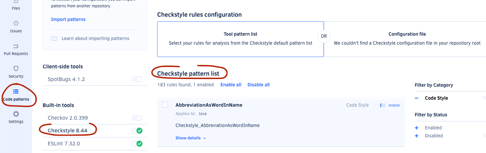
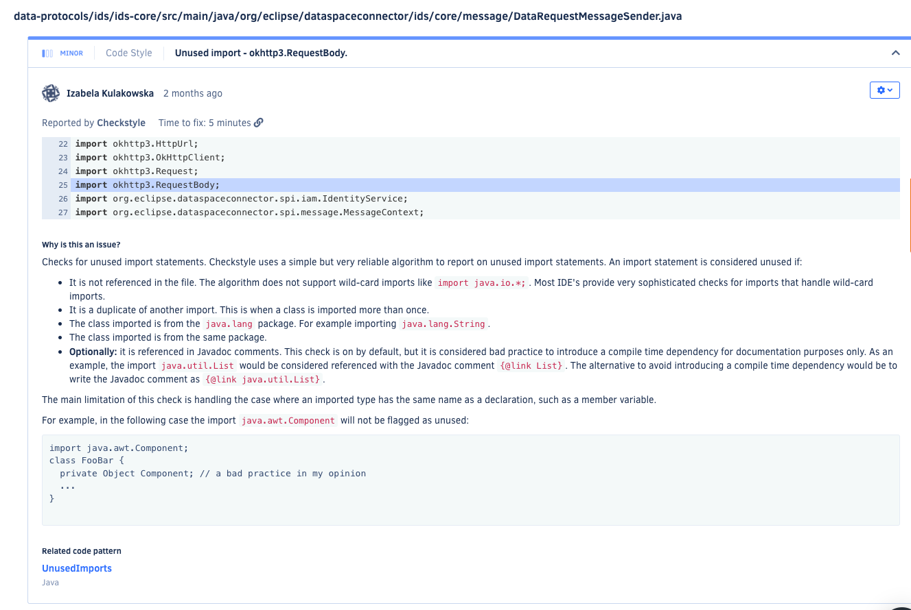
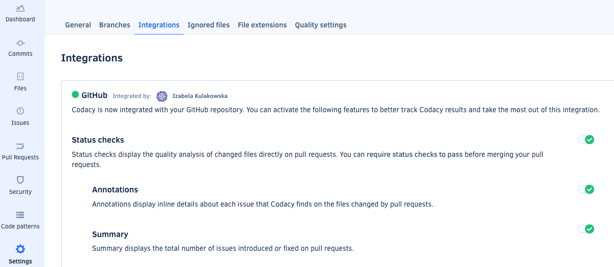
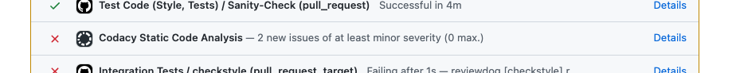

## Checkstyle

[Checkstyle](https://checkstyle.org/) is a static code analysis tool to help programmers write Java code that adheres to a coding standard (coding style, naming patterns, indentation, etc..)

### Running Checkstyle

Use the [Checkstyle Gradle Plugin](https://docs.gradle.org/current/userguide/checkstyle_plugin.html) to run Checkstyle.

```kotlin
plugins {
    checkstyle
}

```

Checkstyle can be configured using [properties](https://docs.gradle.org/current/dsl/org.gradle.api.plugins.quality.CheckstyleExtension.html):

```kotlin
checkstyle {
        configFile = rootProject.file("resources/edc-checkstyle-config.xml")
        maxErrors = 0 
    }
```

Checkstyle generates reports which can be configured:

```kotlin
tasks.withType<Checkstyle> {
        reports {
            html.required.set(false)
            xml.required.set(false)
        }
    }
```

### Usage of Checkstyle in EDC

Checkstyle is configured in EDC repository running on every build. It's configured to break the build on every error or warning.

Checkstyle is set up to run explicitly in [Github Workflow](./.github/workflows/verify.yaml) on every change in a Pull Request posting comments on every
failure:


More information about Checktyle in EDC can be found in [the doc about the style guide](./styleguide.md).

### Running Checkstyle with Codacy

Checkstyle is available as a built-in tool in Codacy. By clicking on the tool the Checkstyle rule set can be configured.




With this feature toggled Codacy scans the code and can apply the checks on the PRs. From the Codacy dashboard we can see the issues found by Checkstyle
with an explanation why it's an issue:



Codacy offers also an integration with Github Actions checks that can be applied on new PRs.

It can be enabled from Codacy website -> Settings -> Integrations



With that we can see the checks reports under the PRs in Github:



Going into details we can see a link to the issues report on Codacy:


Using Checkstyle with Codacy has an advantage of keeping all checks in the same shared dashboard where all code quality analysis from different tools are
combined. It helps to monitor the current status of the code quality in the repository.
However, if the goal is to have checks reported in the PR then running Checkstyle explicitly in Github Actions offers better visibility as the checks are
posted directly in the PR review discussion by Github Actions bot.

### Checkstyle in the Intellij

EDC style guide recommends using [Checkstyle-IDEA plugin](https://plugins.jetbrains.com/plugin/1065-checkstyle-idea).
To use [edc-checkstyle-config.xml](./resources/edc-checkstyle-config.xml) config file we have to create new Active configuration in checkstyle preferences:


After installing the plugin it should be visible as one of the tool windows (View -> Tool windows -> Checkstyle). Then to run the scan we have to pick the
created configuration and click e.g. "Check Project" or "Check current file".


