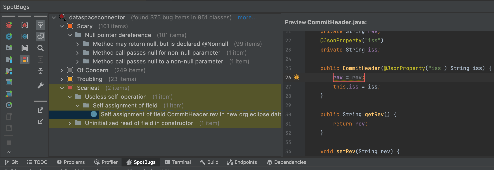
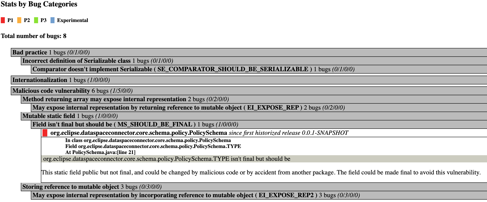
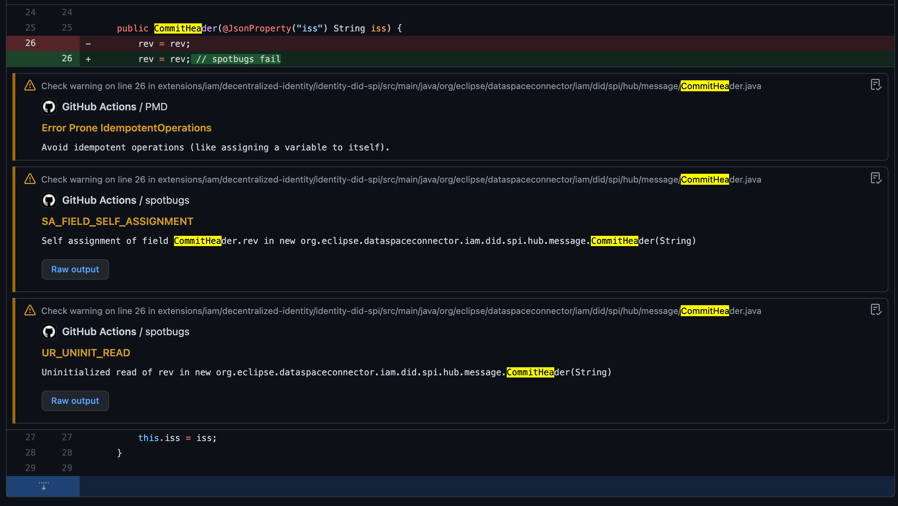

# Spotbugs

[Spotbugs](https://spotbugs.github.io/) is a program which uses static analysis to look for bugs in Java code. It looks for instances of “bug patterns” — code instances that are likely to be errors by inspecting Java bytecode.

## Running SpotBugs with the IntelliJ plugin

The [Spotbugs Intellij plugin](https://plugins.jetbrains.com/plugin/14014-spotbugs) runs Spotbugs directly from the IDE. This is the most effective way to look and fix Spotbugs issues from the developers perspective. Running the IntelliJ plugin on a machine with a 2.3Ghz 8-Core Intel Core i9 CPU running takes around 1 minute.



## Running SpotBugs with Gradle

Use the [Spotbugs Gradle Plugin](https://github.com/spotbugs/spotbugs-gradle-plugin) to run Spotbugs.

The plugin is configured to generate html reports and with a file for accepted exclusions. An initial set of exclusions can be taken from sample open source projects like the [Azure Java SDK](https://github.com/Azure/azure-sdk-for-java/blob/main/eng/code-quality-reports/src/main/resources/spotbugs/spotbugs-exclude.xml).

Running `gradle spotbugsMain` takes around 3.5 minutes on a machine with a 2.3Ghz 8-Core Intel Core i9 CPU.

```kotlin
plugins {
    id("com.github.spotbugs") version "5.0.5"
}

dependencies {
    spotbugsPlugins("com.h3xstream.findsecbugs:findsecbugs-plugin:1.11.0")
}

spotbugs {
    ignoreFailures.set(true) // if false, build fails on bugs
    excludeFilter.set(file("$rootDir/resources/spotbugs-excludes.xml"))
}

tasks.spotbugsMain {
    reports.create("html") {
        required.set(true)
        outputLocation.set(file("$buildDir/reports/spotbugs.html"))
        setStylesheet("fancy-hist.xsl")
    }
}
```

The [Find Security Bugs](https://find-sec-bugs.github.io/) plugin extends Spotbugs with additional security checks.

Spotbugs can be quite resource intense. The [effort configuration](https://spotbugs.readthedocs.io/en/stable/effort.html) helps tune Spotbugs accordingly for each individual project.

Similar to PMD, an own report is generated per each Gradle module, which is not practical. Unfortunately there is no good solution for this other than creating a custom solution with a XSL aggregation/transformation of Spotbugs XML output files.

A pragmatic setup would to use the Gradle setup only to enforce that no open Spotbugs issues remain when running CI, while using IDE plugins to visualize and fix issues locally.



## Running Spotbugs with Github Actions

The [Spotbugs Github Action](https://github.com/jwgmeligmeyling/spotbugs-github-action) allows running Spotbugs from a CI workflow and uploading the results to Github.

```yaml
- name: Gradle Run Spotbugs
  run: ./gradlew spotbugsMain
- uses: jwgmeligmeyling/spotbugs-github-action@master
  with:
    path: '**/spotbugs.xml'
```

Adding these steps leads to Github generating annotations for the violations found that will be highlighted in PRs:



## Running Spotbugs with Codacy

According to [the docs](https://docs.codacy.com/related-tools/local-analysis/running-spotbugs/), codacy supports Spotbugs integration.

We configured a [pipeline](.github/workflows/codacy-analysis.yaml) to run Spotbugs on pushes, but we were not able to get the analysis running, as it seems that classes and sources are not detected properly despite trying to define class/source directories as described in the [documentation](https://docs.codacy.com/related-tools/local-analysis/running-spotbugs/#detecting-sources-and-compiled-classes). See [failing CI run](https://github.com/Agera-CatenaX/EclipseDataSpaceConnector/runs/4925578885?check_suite_focus=true).

```
Error executing the tool
java.io.IOException: IOException while scanning codebases
	at edu.umd.cs.findbugs.FindBugs2.execute(FindBugs2.java:311)
	at com.codacy.tools.spotbugs.SpotBugs$.$anonfun$runTool$1(SpotBugs.scala:113)
	at scala.util.Try$.apply(Try.scala:213)
	at com.codacy.tools.spotbugs.SpotBugs$.runTool(SpotBugs.scala:82)
	at com.codacy.tools.spotbugs.SpotBugs$.$anonfun$apply$9(SpotBugs.scala:52)
	at scala.collection.TraversableLike.$anonfun$map$1(TraversableLike.scala:285)
	at scala.collection.immutable.Set$Set2.foreach(Set.scala:181)
	at scala.collection.TraversableLike.map(TraversableLike.scala:285)
	at scala.collection.TraversableLike.map$(TraversableLike.scala:278)
	at scala.collection.AbstractSet.scala$collection$SetLike$$super$map(Set.scala:53)
	at scala.collection.SetLike.map(SetLike.scala:105)
	at scala.collection.SetLike.map$(SetLike.scala:105)
	at scala.collection.AbstractSet.map(Set.scala:53)
	at com.codacy.tools.spotbugs.SpotBugs$.apply(SpotBugs.scala:53)
	at com.codacy.tools.scala.seed.DockerEngine.executeTool(DockerEngine.scala:53)
	at com.codacy.tools.scala.seed.DockerEngine.$anonfun$main$2(DockerEngine.scala:35)
	at scala.util.Success.$anonfun$map$1(Try.scala:255)
	at scala.util.Success.map(Try.scala:213)
	at com.codacy.tools.scala.seed.DockerEngine.$anonfun$main$1(DockerEngine.scala:27)
	at scala.util.Success.flatMap(Try.scala:251)
	at com.codacy.tools.scala.seed.DockerEngine.main(DockerEngine.scala:26)
	at com.codacy.tools.spotbugs.Engine.main(Engine.scala)
Caused by: edu.umd.cs.findbugs.classfile.ResourceNotFoundException: Resource not found: java/lang/Object.class
	at edu.umd.cs.findbugs.classfile.impl.ClassPathImpl.lookupResource(ClassPathImpl.java:162)
	at edu.umd.cs.findbugs.classfile.impl.ClassPathBuilder.build(ClassPathBuilder.java:282)
	at edu.umd.cs.findbugs.FindBugs2.buildClassPath(FindBugs2.java:708)
	at edu.umd.cs.findbugs.FindBugs2.execute(FindBugs2.java:245)
	... 21 more
```

## Reported EDC issues

Spotbugs reports 303 issues spread across 27 bug patterns of high and medium priority. See [Spotbugs documentation](https://spotbugs.readthedocs.io/en/stable/bugDescriptions.html).

| Priority | Pattern                                 | Description                                         | Category       | Count |
| -------- | --------------------------------------- | --------------------------------------------------- | -------------- | ----- |
| 🚨 1      | DM_DEFAULT_ENCODING                     | Reliance on default encoding                        | I18N           | 11    |
| 🚨 1      | DMI_RANDOM_USED_ONLY_ONCE               | Random object created and used only once            | BAD_PRACTICE   | 5     |
| 🚨 1      | MS_SHOULD_BE_FINAL                      | Field isn't final but should be                     | MALICIOUS_CODE | 3     |
| 🚨 1      | NP_NONNULL_PARAM_VIOLATION              | Method call passes null to a non-null parameter     | CORRECTNESS    | 1     |
| ⚠️ 2      | DCN_NULLPOINTER_EXCEPTION               | NullPointerException caught                         | STYLE          | 7     |
| ⚠️ 2      | DLS_DEAD_LOCAL_STORE                    | Dead store to local variable                        | STYLE          | 2     |
| ⚠️ 2      | EI_EXPOSE_REP                           | May exposeinternal representation by returning reference to mutable object | MALICIOUS_CODE | 99    |
| ⚠️ 2      | EI_EXPOSE_REP2                          | May expose internal representation by incorporating  reference to mutable object | MALICIOUS_CODE | 130   |
| ⚠️ 2      | EQ_COMPARETO_USE_OBJECT_EQUALS          | Class defines compareTo(...) and uses Object.equals() | BAD_PRACTICE   | 1     |
| ⚠️ 2      | IM_BAD_CHECK_FOR_ODD                    | Check for oddness that won't work for negative numbers | STYLE          | 1     |
| ⚠️ 2      | MS_EXPOSE_REP                           | Public static method may expose internal representation by returning array | MALICIOUS_CODE | 1     |
| ⚠️ 2      | MS_PKGPROTECT                           | Field should be package protected                   | MALICIOUS_CODE | 1     |
| ⚠️ 2      | NP_BOOLEAN_RETURN_NULL                  | Method with Boolean return type returns explicit null | BAD_PRACTICE   | 1     |
| ⚠️ 2      | NP_LOAD_OF_KNOWN_NULL_VALUE             | Load of known null value                            | STYLE          | 3     |
| ⚠️ 2      | NP_NULL_ON_SOME_PATH_FROM_RETURN_VALUE  | Possible null pointer dereference due to return value of called method | STYLE          | 21    |
| ⚠️ 2      | RCN_REDUNDANT_NULLCHECK_OF_NULL_VALUE   | Redundant nullcheck of value known to be null       | STYLE          | 3     |
| ⚠️ 2      | SA_FIELD_SELF_ASSIGNMENT                | Self assignment of field                            | CORRECTNESS    | 1     |
| ⚠️ 2      | SE_COMPARATOR_SHOULD_BE_SERIALIZABLE    | Comparator doesn't implement Serializable           | BAD_PRACTICE   | 1     |
| ⚠️ 2      | SS_SHOULD_BE_STATIC                     | Unread field, should this field be static?          | PERFORMANCE    | 2     |
| ⚠️ 2      | ST_WRITE_TO_STATIC_FROM_INSTANCE_METHOD | Write to static field from instance method          | STYLE          | 1     |
| ⚠️ 2      | UC_USELESS_OBJECT                       | Useless object created                              | STYLE          | 1     |
| ⚠️ 2      | UL_UNRELEASED_LOCK_EXCEPTION_PATH       | Method does not release lock on all exception paths | MT_CORRECTNESS | 1     |
| ⚠️ 2      | UPM_UNCALLED_PRIVATE_METHOD             | Private method is never called                      | PERFORMANCE    | 1     |
| ⚠️ 2      | UR_UNINIT_READ                          | Uninitialized read of field in constructor          | CORRECTNESS    | 1     |
| ⚠️ 2      | URF_UNREAD_FIELD                        | Unread field                                        | PERFORMANCE    | 1     |
| ⚠️ 2      | UUF_UNUSED_FIELD                        | Unused field                                        | PERFORMANCE    | 1     |
| ⚠️ 2      | VA_FORMAT_STRING_USES_NEWLINE           | Format string should use %n rather than \n          | BAD_PRACTICE   | 2     |

Most findings pinpoint real problems that could lead to production issues. Generally these can be fixed with a relatively low effort. 

There is still quite a few false positives that would need to be ignored, but given that this can be easily achieved using annotations or exclusion filters seems like Spotbugs provides a high value VS effort ratio. A suggestion could be to start with a rather lenient configuration and increase strictness as appropriate.