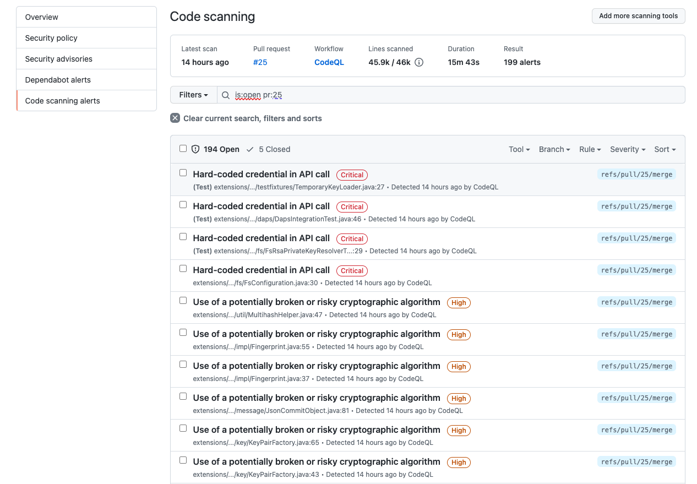
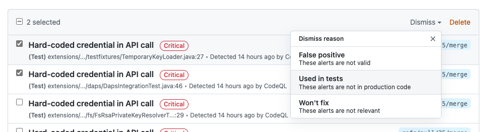
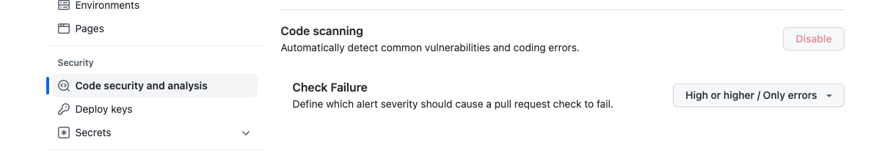

# CodeQL

CodeQL is a semantic code analysis engine developed by GitHub to automate security checks. A database is extracted from source code that can be analysed with a powerful query language. Each single query can be thought of as a “check” or “rule” representing a distinct security vulnerability that is being searched for. There is an available set of standard CodeQL queries, written by GitHub researchers and community contributors, and custom ones can be written too. See [Writing queries](https://codeql.github.com/docs/writing-codeql-queries/codeql-queries/) in the CodeQL docs for more information.

## Extending the scope of CodeQL queries scan

CodeQL is integrated in the EDC CI build in a dedicated [Github workflow](.github/workflows/codeql-analysis.yml).
Currently the workflow runs on PRs and commits to the main branch and runs the default set of queries as provided by CodeQL.

To have more detailed scan we decided to extend the CodeQL queries, by using the built in CodeQL query suite: [security-and-quality](https://docs.github.com/en/code-security/code-scanning/automatically-scanning-your-code-for-vulnerabilities-and-errors/configuring-code-scanning#using-queries-in-ql-packs).

```yaml
      # Initializes the CodeQL tools for scanning.
      - name: Initialize CodeQL
        uses: github/codeql-action/init@v1
        with:
          languages: ${{ matrix.language }}
          queries: +security-and-quality
```

To reduce amount on false positive alerts we excluded the test code from the scan by replacing CodeQL Autobuild with a task that compiles only Java 
production sources:

```yaml
      # Compiles production Java source (without tests)
      - name: Build
        run: ./gradlew compileJava
```
The results can be visible in the Github Workflow check view under the PR and in Security Tab.



From this view the alerts can be analysed and dismissed/removed if they are not applicable.



After clicking on the alert we can see a view with more detailed explanations about it, references and examples.

Dismissing the alerts will dismiss them on all branches. Dismissed alerts can be later reopened. Deleting the alerts doesn't prevent them from appearing on
the next scans.
[Here](https://docs.github.com/en/code-security/code-scanning/automatically-scanning-your-code-for-vulnerabilities-and-errors/managing-code-scanning-alerts-for-your-repository#dismissing-or-deleting-alerts) you can find more information about dismissing/deleting CodeQL alerts.

In Settings tab we can also define the alert severities causing [pull request check failure](https://docs.github.com/en/code-security/code-scanning/automatically-scanning-your-code-for-vulnerabilities-and-errors/configuring-code-scanning#defining-the-severities-causing-pull-request-check-failure).


