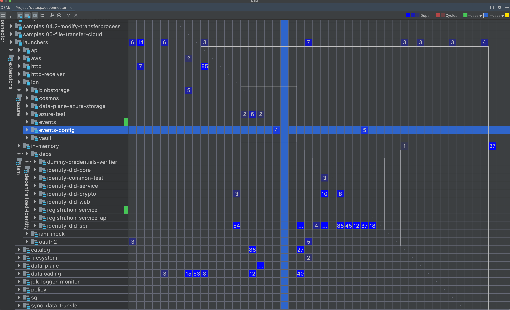

# EDC Repository Split

Currently, the EDC codebase is stored in a monorepo in Github where core modules coexist with vendor-specific extensions. This strategy allows for flexibility especially during the initial phase of development where bigger application-wide refactorings are common. Integration tests spanning several extensions are easy to write and help to reduce the likelihood of a regression within a certain module affecting other modules. 

As more contributors join the project and more vendor-specific implementations are added to the codebase, the drawbacks of a monorepo become apparent:

- A new version of an SPI forces an immediate adaptation of all implementing modules. This requires coordination among several teams, ultimately slowing down the development cycle.
- A new version of a module or extension requires a full EDC release, even for small fixes.
- A full test suite run for any change is suboptimal. Having separate smaller modules improves CI performance, but this can be achieved as well on a monorepo by having multiple parallel CI pipelines.
- Danger of having too much vendor-specific code within EDC core, giving the false impression of not being a 100% cloud-agnostic project.
- Danger of having too many contributors to the EDC Core functionality leading to misalignment and inconsistencies.

## EDC multirepo strategy

### By vendor

EDC defines a series of core APIs in the [spi](../../../../spi) module. Implementations for these APIs are provided by using extensions. 
An example of this is `TransferProcessStore` in the `transfer-spi` core module with available implementations `InMemoryTransferProcessStore` in the `transfer-store-memory` extension, and a `CosmosTransferProcessStore` in the `transfer-process-store-cosmos` extension. 
This option involves splitting a repo for each vendor providing an implementation for core SPI interfaces: 

```
<EDC> (in EDC repo)
    |_ <InMemory Extensions> (in EDC repo)
    |
    |_ <Azure Extensions> (in Azure repo)
    |_ <AWS Extensions> (in AWS repo)
    |_ <Google Extensions> (in Google repo)
```

Important considerations:

- A default implementation that can be used in EDC core to perform testing is required (for instance an in-memory version of a store like 
  `InMemoryTransferProcessStore`).
- A set of integration tests must be provided by the core EDC repository to verify that components work as expected using the default implementation. These 
  test can be reused by other implementations to verify conformance.
- An overarching set of E2E test might be required for common scenarios spanning across several vendor implementations.
- Separate release cycles for vendor extensions is possible, but an adequate versioning strategy is required to simplify understanding of compatibility with 
  EDC core (for instance Azure Extensions 1.1.x are always compatible with EDC core 1.1).
- EDC repository lacks of real world implementations as they are moved to vendor repositories.
- This strategy conforms to Conway's law which says that the system design should mirror the organization's communication structure.

### By domains (microservices)

This options opts for a split by microservices. At the time of writing 2 architectural components come into question for such a split: EDC Core and DPF. 

```
<EDC Core> (in EDC repo)
    |_ <In Memory Extensions> (in EDC repo)
    |_ <Azure Extensions> (in EDC repo)
    |_ <AWS Extensions> (in EDC repo)
    
<DPF> (in DPF repo)
    |_ <In Memory Extensions> (in DPF repo)
    |_ <Azure Extensions> (in DPF repo)
```

Important considerations:

- Well-defined and stable interfaces between microservices at a higher level than programmatically 
- Split by microservice allows for more flexibility on appropriate technology choices for each service
- Separate release and deployment cycles
- Requires overarching set of E2E tests to test microservices operating together

### Hybrid approach

The "by vendor" and "by domain" approaches can be combined as well. Thus, for each microservice a set of repositories can be provided for vendors implementing extensible parts of it.

## Repo Split Spike

To simulate the development cycle with a split repo, we have copied the EDC repository into an own project and split it following a "by vendor" approach:
- [EDC Core](https://github.com/agera-edc/DataSpaceConnector-Core)
- [EDC Azure Extensions](https://github.com/agera-edc/DataSpaceConnector-AzureExtensions)

Splitting the repo required extracting the vendor extension from the core repo into a separate one, and changing the gradle build to refer to released artefact versions within a [GitHub Packages](https://github.com/orgs/agera-edc/packages?repo_name=DataSpaceConnector-Core) repository. Artefacts were previously published into this repository using the [publish](https://github.com/agera-edc/DataSpaceConnector-Core/actions/workflows/publish.yaml) workflow.

Test fixture dependencies published using the [java-text-fixtures](https://docs.gradle.org/current/userguide/java_testing.html#publishing_test_fixtures) plugin required declaring dependencies in a different way:

```kotlin
    // monorepo text fixture dependency
    testImplementation(testFixtures(project(":common:util")))

    // equivalent dependency for vendor repo dependency
    testImplementation("org.eclipse.dataspaceconnector:common-util:${edcCoreVersion}:test-fixtures")
```

During the spike we analysed the development cycle after the repo split across different areas of impact:
- Local development of changes crossing the repositories.
- Publishing and versioning EDC artifacts.
- Release cycle for EDC Core and the Vendor Extensions.

Next, possible solution for these areas is discussed for three different scenarios.

### Scenario 1: code change spanning across core and vendor repositories

#### Local development

Publishing snapshot versions to local maven repositories can be useful for local development of changes spanning across core and vendor repositories.

1. Change is made in EDC Core repository.
1. Developer publishes an EDC Core snapshot version to the local Maven repository using e.g. `./gradlew publishToMavenLocal` command.
1. New version is visible locally in the EDC vendor repository after gradle dependencies are refreshed. IntelliJ does this step automatically very quickly.
   - Note that for the gradle to pick up libraries from local maven the `mavenLocal()` must be added to the list of repositories.
   
#### PRs and CI

After finishing local development a PR should be created for EDC Core first. A snapshot version for EDC Core needs to be published to the Maven Snapshot repository, so that it can be declared as a dependency from the vendor repository change. This step can be automated by a CI workflow that automatically publishes branch-specific snapshots on every push e.g. `0.0.1-[branch-name]-SNAPSHOT`. See [sample PR](https://github.com/agera-edc/DataSpaceConnector-Core/pull/1) for more details.

Once the EDC Core PR is ready, the PR on the vendor repository can be opened, using the aforementioned branch-specific snapshot for the EDC Core dependencies. See [example PR](https://github.com/agera-edc/DataSpaceConnector-AzureExtensions/pull/1) on vendor repository.

Once the change is accepted the merging sequence is the following:
1. Merge EDC Core PR
1. EDC Core snapshot is published for the target merge branch
1. Vendor repository PR is adapted to use the new published snapshot version
1. Vendor repository PR is merged

Based on above steps we can distinguish following CI features required to enable this scenario:

1. EDC Core repository: publishing snapshot version with `branch_name` prefix/suffix on every push to a branch. Produces `0.0.1-[branch-name]-SNAPSHOT` version.
1. EDC Core repository and vendor repository: publishing snapshot version for staging changes on every merged PR. Produces `0.0.1-SNAPSHOT` version.

#### Release cycles

The release cycle for EDC Core and vendor Extensions must be well aligned. The following points describe a possibility how the release cycles can be defined and 
depend on each other. This option assumes that the releases of EDC Core always triggers releases on vendor repositories.

1. EDC Core releases are scheduled on demand, once a planned set of features is implemented and tested.
   - Releasing EDC Core regularly (e.g. once a day/week) could be also considered as an option, but less frequent but more stable releases planned in advance seem to 
     allow for a more organised structure of versions.
1. Every EDC Core release triggers (if possible automatically using Github workflow pipelines) a corresponding release in EDC Extensions repositories.

Note that above-mentioned release steps assume that EDC Core and Vendor releases are aligned. Between the releases the vendor repository uses the corresponding 
snapshot version from EDC Core. It means that this approach does not prevent the EDC Core from publishing snapshots containing breaking changes 
which can block or slow down development in Vendor repositories. A benefit of this approach is though that incompatibilities can be discovered and fixed 
early. Possible mitigations of this risk include:
- Having an agreement that changes in EDC Core should be introduced with backward compatibility in mind
  - e.g. instead of changing ConsoleMonitor interface, it can be marked as @Deprecated and new interface can be introduced allowing the extensions adapt 
    to the changes.  
- Having a suite of integration tests running in Vendor repository that constantly checks if the snapshots are in sync.

### Scenario 2: code change within a vendor repository (e.g. bugfix)

Changes within a vendor repository do not impact EDC Core repository. Therefore, development of isolated changes in vendor repositories does not require any additional effort:

1. Change is made in Vendor repository.
1. PR is created in Vendor repository.
1. Vendor repository PR is merged.
1. In case of urgent bugfix new version of Vendor artifact is released, otherwise snapshot version is published.

Releasing new versions of a vendor extension (for instance a bugfix) can be done independently of the EDC core repository. The only important point to take into account is that a version scheme is needed to track compatibility between EDC Core and vendor extensions versions. A simple but effective versioning strategy could be:

```
EDC Core version: <MAJOR>.<MINOR>
Extension version: <MAJOR>.<MINOR>.<PATCH>
```

Compatible EDC Core and Extensions should have the same `<MAJOR>` and `<MINOR>` version. The `<PATCH>` version allows for extensions to release further artefacts compatible with the same core version.

| EDC Core version | Vendor extension version | Compatibility |
|------------------|--------------------------|---------------|
| 2.1              | 2.1.x                    | ✅             |
| 2.1              | 1.x.x                    | ❌             |
| 2.1              | 2.2.x                    | ❌             |
| 2.1              | 3.x.x                    | ❌             |


### Scenario 3: SPI version upgrade

A repository split by vendor allows for a delay between an SPI upgrade and the rollout of the implementations for each vendor. Thus, it is possible to release a new EDC core version with a default implementation (and arguably a reference implementation for a vendor):

1. EDC Core team releases a preview for a new SPI version together with a reference implementation
1. Vendor extension teams validate the changes and give a go for the EDC Core changes
1. EDC Core is released. A versioning scheme makes clear which vendor extensions are compatible.
1. Each vendor extension team can release its own implementation at its own pace.

### Conclusion

Working with multirepo adds an overhead to the development and release cycle process. Our impression is that the inner local development loop with the local maven repository allows for an efficient enough process, most of all given that changes spanning across EDC Core and vendor extensions should not be that common. Overhead in PRs and releases can be minimized by automating inefficient recurring processes like branch-snapshot publishing.

## Next steps

Our suggestion would be to start with a repository split by vendor, extracting Azure Extensions into an own repository first as shown in the previous examples. This would involve the following next steps:
1. Agree with EDC community on repo split and versioning strategy
1. Setup Maven repository for EDC
1. Make sure that default vendor-agnostic implementations for all services required for integration testing are available. Adapt integration tests to use these default implementations to test EDC core. 
1. Extract Azure dependencies repository

### Appendix

#### General Monorepo/Multirepo comparison

| Monorepo                                                                              | Multirepo                                                                                               | 
|---------------------------------------------------------------------------------------|---------------------------------------------------------------------------------------------------------|
| Easier to do Application wide refactoring                                             | Easier to do small refactorings of modules/libraries                                                    |
| More difficult to break functionality </br>(they are visible and can be solved early) | Easy to break the functionality, but breaking changes can be released (new version)                     | 
| Central code management (easier to navigate the code)                                 | Not easy to locate the code/debug (need for searching in multiple repos)                                |
| Easier to share and maintain one Development culture (style guides etc.)              | Working autonomously on the library code (different development cultures)                               | 
| Slow CI builds                                                                        | Faster CI builds                                                                                        | 
| Introducing breaking changes slows the development cycle                              | Breaking changes are released as a new version, do not slow down development cycles of other libraries  |
| Heavyweight codebase                                                                  | Multiple lightweight codebases                                                                          |
| Lower barriers of entry (everything in one place) to understand the project           | Contributing is easier (forking, no need to understand the whole repo)                                  |
| Good white box testing because all projects are testable together                     | Good black box testing because each project is testable separately, and verifiable independently        |

### Using git submodules for local development

[Git submodules](https://git-scm.com/book/en/v2/Git-Tools-Submodules) was evaluated as an alternative to the local maven repository for the inner development loop (see [git-submodule branch](https://github.com/agera-edc/DataSpaceConnector-AzureExtensions/tree/git-submodules) in Azure Extensions repo). With this setup, vendor extensions could include the EDC Core codebase as a submodule with the intent of compiling directly against the EDC Codebase instead of using pre-built snapshot artifacts, and thus skipping the step of having to publish those.

The main issue with this approach is that publishing snapshot artefacts are still required to build and release EDC Core and vendor extensions in CI. This means the 2 approaches must coexist, one in CI and the other one for local development. 

Additionally, gradle files need to be adapted to use EDC Core as available in the submodule, which we could not get running within the scope of this spike. Gradle and Maven were not designed with this use case in mind.

Finally, the development cycle with the local Maven repository seems to be efficient enough, publishing local snapshots takes few seconds and IntelliJ automatically picks and refreshes projects using these snapshots.

### Dependency analysis

This section shows if there are any blockers or tightly coupled dependencies that can have impact on the repo split process (for the current state of the
repository).

It uses Intellij Dependency Matrix tool (Code -> Analyse Code -> Dependency Matrix).

#### By domains (microservices)

Currently, only microservice in the repository is DPF. There are no dependencies in the core modules that depend on data-plane or its extensions.

Below dependency matrix shows azure -> data-plane-azure-storage uses data-plane. Both will be a part of new repo in this scenario.


#### By vendors

Dependency that would need to be solved to extract Azure as a separate repo:

Azure events-config is used in iam->decentralized-identity->registration-service.

