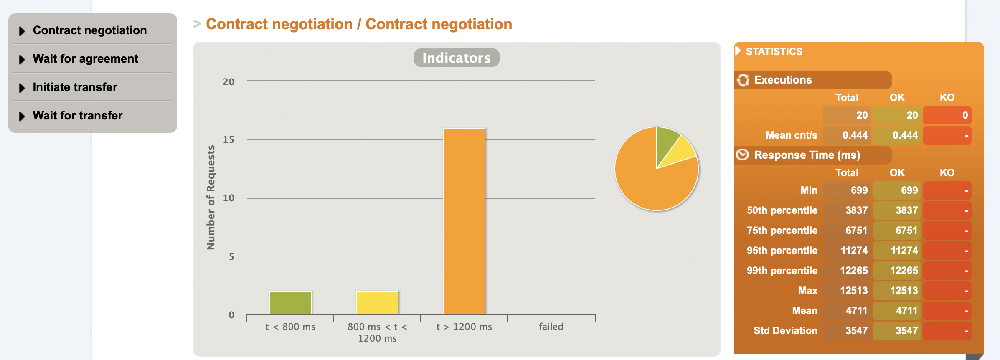

# Performance Testing with Gatling

## Decision

We use Gatling to perform functional and performance testing.

Performance tests are run over a single iteration as part of CI pipeline, to serve as functional system tests. The Gatling report is published to document trends over time.

We plan to expand the scale of Gatling tests in order to test load, concurrency and stress scenarios.

We will perform load testing of the application in order to:

- Ensure application performance degrades gracefully as concurrency increases.
- Measure response times for the main queries and operations on a regular basis to detect performance degradation.
- Provide reusable harness for EDC integrators to validate that their application meets SLAs.

## Rationale

Load/concurrency tests should be developed and regularly exercised (even when no significant load is expected on an application) as they can help identify logical or configuration errors that could otherwise manifest themselves in hard to reproduce ways. Conversely, if performance does not significantly degrade even under high load, it can indicate that the provisioned resources might be scaled down in order to save costs.

We preferred to use a tool allowing writing tests in Java, to reduce learning curves and allows reusing any Java code that might be written in the future to help use the client API (e.g. for authentication).

We wanted to avoid having to write tests in one framework for functional testing and in another framework for performance testing. Valid performance tests should include detailed assertions, hence cover the scope of functional tests.

[JMeter](https://jmeter.apache.org/) was considered as an alternative given its popularity and flexibility. The learning curve for JMeter is quite steep, and XML-based test definition is hard to read, especially in PRs. [Gatling](https://github.com/gatling/gatling) is an open-source tool that has been gaining popularity and is now mature.

Gatling allows writing load test scenarios directly in Java :

```java
private ScenarioBuilder scn = scenario("Contract negotiation and data transfer.")
       .repeat(100)
       .on(exec(
          http("Contract negotation")
                        .post("/api/negotiation")
                        // ...
                        .check(status().is(SC_OK)))
        ));
    {
        setUp(scn.injectOpen(atOnceUsers(10))).protocols(httpProtocol);
    }
```

Thanks to its sophisticated DSL and tree structure, it allows measuring. For example, it allows repeatedly polling for contract negotiation completion, while capturing both the metrics of single poll requests and of overall loop completion.

Gatling could be run through a [Gradle plugin](https://gatling.io/docs/gatling/reference/current/extensions/gradle_plugin/). For our needs, it is sufficient to run it from a JUnit test.

Gatling produces a detailed HTML report that can be archived as an artifact.



The HTML report provides multiple sections and interactive charts, such as the one below.


