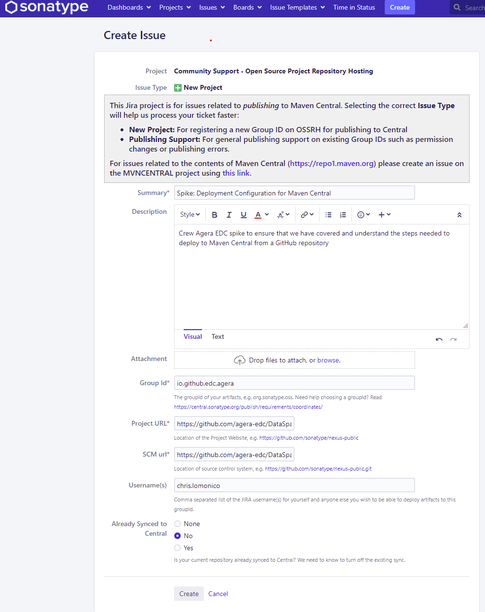

# Publishing Artifacts To Maven Central

## Decision

Enable the publishing of artifacts to Maven Central from the [Eclipse Data Space GitHub Repository](https://github.com/eclipse-dataspaceconnector/DataSpaceConnector)

## Rationale

A workflow in the EDC repository should exist to build and publish release artifacts to Maven Central to enable
developers to utilize the tested and verified libraries. TODO

## TL/DR

- Create a SonarType Jira Account [here](https://issues.sonatype.org/secure/Signup!default.jspa)
- Request namespace in  `OSSRH`.
- Create a GPG key for signing purposes
- Export public key part
- Publish public key to well-known key servers
- Configure plugins in `build.gradle.kts`
- Export private key part
- Configure signing in `build.gradle.kts` using the private key.
- Stage artifacts to OSSRH.
- Release staged artifacts.

## Steps
In order to be able to deploy to Maven Central, the following steps must be carried out

### Jira Account
- Create a SonarType Jira Account [here](https://issues.sonatype.org/secure/Signup!default.jspa)

### Create the Request for OSSRH
- Using the [pre-defined template](https://issues.sonatype.org/secure/CreateIssue.jspa?issuetype=21&pid=10134) create 
a new Jira Issue
  - Provide all required fields including a _unique group id_ that will be used to identify the main package provider
  - Additional guidance on the suggested naming approach can be found [here](https://central.sonatype.org/publish/requirements/coordinates/)
- Submit the issue and await the instructions
  - Wait time seems to be minimal (less than 5 minutes)
  - If there are any issues or errors or changes required:
    - Fix issues
    - Click `Respond` on Jira issue and await further instructions
- Upon successful completion the related Jira issue will be updated to a state of `Resolved` 
  - In activity an entry will be present indicating that the `users` specified during ticket creation in the `Usernames` 
field will have the ability to publish snapshot/release artifacts to the `OSSRH Respoistory`
  - Full instructions on deployment procedures with details can be found [here](https://central.sonatype.org/publish/publish-guide/#deployment)
- Note that it can take up to 2 days for the OSSRH


- A generated update to the Jira ticket will be issued indicating that you will need to create a temporary repository
with the specified name in the ticket to ensure verification of ownership

### Signing Key

If no key exists, one can use `gpg` to generate the key with the following command:

```script
gpg --gen-key
```

Follow the instructions and provide the same information used for registration

- Real Name
- Email

Export the public part of the key

```script
gpg --armor --output public-key.gpg --export [email addres used to generate key]
```
View the exported key file `public-key.gpg` and ensure that it starts with `-----BEGIN PGP PUBLIC KEY BLOCK-----`

Publish the key to _at least 1_ well-known key server.

> For Example:
> 
>https://keyserver.ubuntu.com
>
> or
> 
> https://keys.openpgp.org

Follow the instructions to upload your public key.
- First provide key file or payload of key file pending on public key server you are using
- Execute any required verification steps (such as email confirmation)
- Verify that your key is found in the related key server  

### Gradle

Changes must be made to `build.gradle.kts` in the `root` of the project

> Note: assumption is that Kotlin DSL is being used

### Plugin Configuration

If not present add 
- `maven-publish`
- `id("io.github.gradle-nexus.publish-plugin") version "1.1.0"`
to the `plugins`

Example: 
```java
plugins {
        `java-library`
        `maven-publish`
        checkstyle
        jacoco
        id("com.rameshkp.openapi-merger-gradle-plugin") version "1.0.4"
        id("io.github.gradle-nexus.publish-plugin") version "1.1.0"
        }
```
### Repository Configuration

Ensure that `repositories`  includes `mavenCentral()`

For Example:
```java
repositories {
    mavenCentral()
}
```

### Java Plugin

Maven Central requires `Javadocs` and `sources` to be published with the `JAR` files.  If this both are not present
the validation process with fail.

Configure the `Java` extension to include tasks for `sources` and `javadoc`

For Example:
```java
java{
    withJavadocJar()
    withSourcesJar()
}
```

### OSSHR Publishing

Include the configuration for `nexusPublishing` and for the `sonatype` repository, set the `username` and the `password`
for the automation of creating/closing and releasing staging repositories.  

For Example:
```java
nexusPublishing {
    repositories {
        sonatype {
            username.set(System.getenv("OSSRH_USER") ?: return@sonatype)
            password.set(System.getenv("OSSRH_PASSWORD") ?: return@sonatype)
        }
    }
}
```

Update the `repositories` under the `java-library`, `publishing` extension to include the `OSSRH` staging repo

For Example:
```java
pluginManager.withPlugin("java-library"){
    //....
        publishing {
            repositories {        
                mavenCentral{
                    name="OSSRH"
                    url=uri("https://s01.oss.sonatype.org/content/repositories/snapshots/")
                    credentials{
                        username=System.getenv("OSSRH_USER")
                        password=System.getenv("OSSRH_PASSWORD")
                    }
                }
            }
        }
    //....        
}
```

- The username and password are the same for what was used to create the OSSRH request (same as `Jira` credentials)
- Values for `OSSRH_USER` and `OSSRH_PASSWORD` must be defined and should be protected in the build environment
- The url: https://s01.oss.sonatype.org/content/repositories/snapshots/ is used for staging snapshots
- The url: https://s01.oss.sonatype.org/service/local/staging/deploy/maven2/ is used for release deployements
- For detailed information please see [OSSRH Guide - Getting Started](https://central.sonatype.org/publish/publish-guide/#accessing-repositories)

### Adding Required Metadata to POM

In order to successfully publish to `OSSRH` the generated `pom` file must be updated to include some additional 
information for `licenses`,`developers` and `scm` sections

For Example:
```java
  publications{
      create<MavenPublication>("mavenJava"){
          pom{
              name.set("ageraedc :: ${project.name}")
              description.set("ageraedc :: ${project.name}")
              url.set("https://github.com/agera-edc/DataSpaceConnector")
              licenses{
                  license{
                      name.set("The Apache License, Version 2.0")
                      url.set("http://www.apache.org/licenses/LICENSE-2.0.txt")
                  }
                  developers{
                      developer{
                          id.set("chlomoni")
                          name.set("C.B. Lomonico")
                          email.set("chlomoni@microsoft.com")
                      }
                  }
                  scm{
                      connection.set("scm:git:git@github.com:agera-edc/DataSpaceConnector.git")
                      url.set("https://github.com/agera-edc/DataSpaceConnector")
                  }
              }
          }
      }
  }
```

> More information can be found [here](https://docs.gradle.org/current/userguide/publishing_maven.html#publishing_maven)

### Signing

All deployments to Maven Central must be signed.  Using the same `key` generated above, export
the `private` part of key.

For Example:
```bash
gpg --armor --export-secret-keys <key id> > key.pgp
```

Save the private key file securely; do not share or expose this value anywhere other than any relative CI/CD
service which will be building, signing and publishing the artifacts.

To use in-memory keys, create 3 environment variables to the associated values for the `private` key

For Example:

```bash
ORG_GRADLE_PROJECT_signingKeyId
ORG_GRADLE_PROJECT_signingKey
ORG_GRADLE_PROJECT_signingPassword
```

Modify `build.gradle.kts` to include the signing task

Configure the `signing` plugin

For example:

```java
signing{
    val signingKeyId = System.getenv("ORG_GRADLE_PROJECT_signingKeyId")
    val signingKey = System.getenv("ORG_GRADLE_PROJECT_signingKey")
    val signingPassword = System.getenv("ORG_GRADLE_PROJECT_signingPassword")
    useInMemoryPgpKeys(signingKeyId, signingKey, signingPassword)
    sign(publications["mavenJava"])
}
```

> More information can be found [here](https://docs.gradle.org/current/userguide/signing_plugin.html)

## Remaining Tasks

- Once `OSSRH` spike staging repo is complete, test and implement the approach documented
- Review `build.gradle.kts`  


