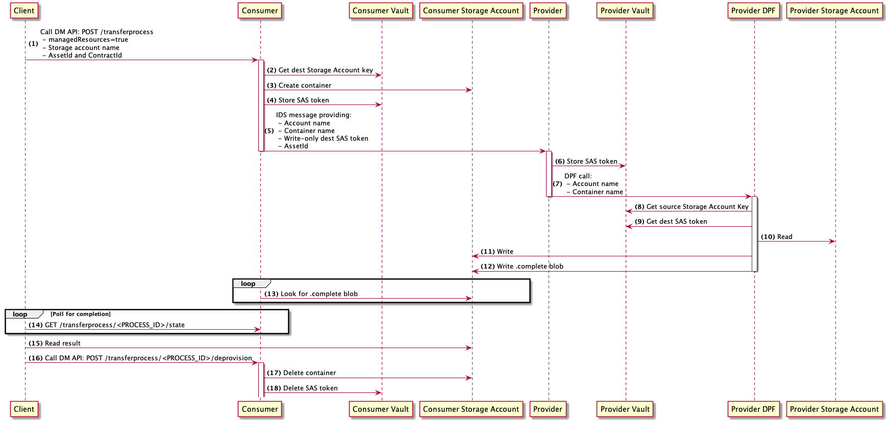

# Blob storage transfer

ADR describing the blob storage transfer end to end flow between 2 participants.

## Description

The data-plane-azure-storage extension can be used on DPF to support blob transfers.
A client can trigger a blob transfer on the consumer side via the Data Management API.
The client needs to use the `managedResources=true` option in its HTTPS request. This option will make sure that the resources needed for the transfer (storage account) are created. [managedResources=false option for Azure storage transfer](https://github.com/eclipse-dataspaceconnector/DataSpaceConnector/issues/1241) is not supported yet. managedResources=false would be used if the client want to use a pre-existing container without creating a new one.  
If something goes wrong during the transfer, the Consumer would not be aware that an error occurred, it would just never see the transferProcess with completed state when polling for the result. There is an [EDC issue](https://github.com/eclipse-dataspaceconnector/DataSpaceConnector/issues/1242) to address this problem.  
Storage accounts access key should be stored in respective Keyvaults before initiating transfers. The consumer will provision a new storage container and generate a write only SAS token to give the provider the possibility to write data to its container.

## Sequence diagram

The following sequence diagram describes the flow to transfer a blob from a Provider storage account to a consumer storage account. Assuming that the contract negotiation have already been done.
It starts from the client triggering the transfer on the consumer side and finishes when the consumer triggers deprovision request for temporarily provisioned storage container.

1. The client calls the data management API to trigger a transfer process and get the corresponding PROCESS_ID. This PROCESS_ID will be used to get the transfer status. For now, managedResources needs to be set to true, to make sure that the consumer provisions the blob container. managedResources=false would be used if the client wants to use a pre-existing container without creating a new one, but this feature is not supported yet.  
2. Consumer gets the destination storage account access key in its Vault.  
3. Consumer creates a container where the Provider DPF may write blobs. The container is created only if the client specifies managedResources=true.
   The [ObjectStorageProvisioner](../../../../extensions/azure/blobstorage/blob-provision/src/main/java/org/eclipse/dataspaceconnector/provision/azure/blob/ObjectStorageProvisioner.java) is responsible for provisioning the container and for generating a SAS token to access the container. 
To generate a [SAS token](https://docs.microsoft.com/en-us/azure/storage/common/storage-sas-overview), a storage account key is needed. This storage account key should be stored and retrieved in the Consumer Keyvault.  
4. Consumer sends an IDS message to the Provider, containing the information needed to write data to the destination container. For example, the destination blob container name and the SAS token needed to write a blob to the container.  
5. Provider stores the SAS token in its Vault.  
6. Provider initiates the blob transfer on the Provider DPF. The provider DPF can be embedded or run in a separated runtime. If it runs on a separated runtime, the Provider initiates the transfer via an HTTPS request.  
7. The Provider DPF gets the source storage account access key in the Provider Vault.  
8. The Provider DPF gets the SAS token needed to write the blob to the consumer blob container.  
9. The Provider DPF reads the data that needs to be transfered. The [AzureStorageDataSource](../../../../extensions/azure/data-plane/storage/src/main/java/org/eclipse/dataspaceconnector/azure/dataplane/azurestorage/pipeline/AzureStorageDataSource.java) provides the source data stream.  
10. The Provider DPF writes the data to the destination blob so that the consumer can access the data.
The [AzureStorageDataSink](../../../../extensions/azure/data-plane/storage/src/main/java/org/eclipse/dataspaceconnector/azure/dataplane/azurestorage/pipeline/AzureStorageDataSink.java) transfers the data to the blob destination.
11. When the transfer is finished, the Provider DPF writes a blob called `.complete`.
12. In the meantime, the client polls the transfer status regularly on the consumer endpoint `/transferprocess/<PROCESS_ID>/state`.  
13. To determine if the transfer is completed, the consumer checks if a blob named `.complete` exists in the container.  
14. When the transfer is finished, the client can read the blob.  
15. Then, the client can call the Data Management API to destroy the data.  
16. Consumer deletes the container containing the blob and the SAS token. The [ObjectStorageProvisioner](../../../../extensions/azure/blobstorage/blob-provision/src/main/java/org/eclipse/dataspaceconnector/provision/azure/blob/ObjectStorageProvisioner.java) is responsible for deprovisioning the container.
